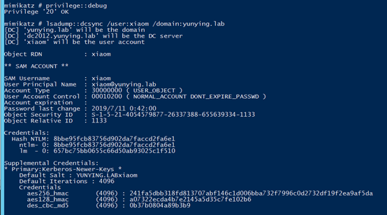
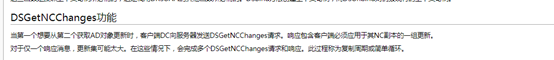
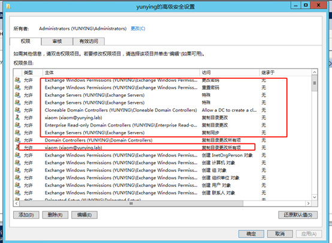
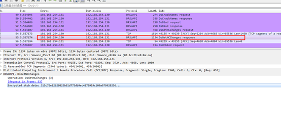

# DCSync利用与检测
2015年8月Mimkatz增加的一个主要功能是“DCSync”，它有效地“模仿”域控制器并从目标域控制器请求帐户密码数据。DCSync由Benjamin Delpy和Vincent Le Toux编写。

DCSync之前的利用方法是在域控制器上运行Mimikatz或Invoke-Mimikatz以获取KRBTGT密码哈希来创建Golden Tickets。然而借助Mimikatz的DCSync和相应的权限，攻击者可以通过网络从域控制器提取密码哈希以及以前的密码哈希，而无需交互式登录或复制Active Directory数据库文件（ntds.dit）。（也就是说从本地转为远程）。



同时要说明的是在最新的Exchange中通过NTLMRelay最后实现的功能也是DCSync

## 原理
```
1、	在指定的域名中发现域控
2、	通过GetNCChanges请求域控复制用户凭据。（使用Directory Replication Services DRS目录复制服务远程协议）
```


https://docs.microsoft.com/en-us/openspecs/windows_protocols/ms-drsr/f977faaa-673e-4f66-b9bf-48c640241d47
详细信息可以参考官方文档提供的关于目录复制服务的简单说明，这个协议的主要作用其实是为了多个域控的环境中不同域控之间同步信息时使用的，主要是为了域控之间信息的一致性。大多数复制相关任务都在目录复制服务（DRS）远程协议上指定。实现此类协议的Microsoft API称为DRSUAPI。
https://wiki.samba.org/index.php/DRSUAPI



DCSync使用的就是DRSUAPI中的DSGetNCChanges接口。
文中描述可以理解为，当一个（攻击者）想到从另一个（域控）中获取更新时，就会发起DSGetNCChanges请求，响应包含客户端必须应用于其NC副本的一组更新（域用户HASH值）。

## Delegating Rights to Pull Account data

可以使用常规域用户进行DCSync（有些文章表达的观点是需要使用域管理员账户或者是域控上的Administrator账户，实际并不是），前提是要委派给这个域用户以下三个权限（三个权限中的其中一个）。

```
复制目录更改Replicating Directory Changes (DS-Replication-Get-Changes)
复制目录更改所有Replicating Directory Changes All (DS-Replication-Get-Changes-All)（Exchange用的就是这个）
正在复制筛选集中的目录更改Replicating Directory Changes In Filtered Set (rare, only required in some environments)
```

把ADSI中，域的DACL中添加一条普通域账号xiaom的“复制目录更改所有项”之后，这个xiaom账号就具有了可以在test域中进行DCSync的权限。



可以看到默认情况下Administrators组和Domain Controller组的成员具有这些权限。

## DCSync的检测与防御
只要是非两个域控之间的DsGetNCChange请求都可以高度怀疑为DCSync/DCShadow攻击。



可以在防御的时候将域控之间设置为白名单（两个域控之间为正常），域内主机和域控中间存在此类连接即判断为DCSync或者是DCShadow。

在防御上的策略建议是在每次针对域内的ACL进行更改时都做记录，并且定时排查域内的DACL是否存在被修改的情况。可以使用工具：
https://github.com/nccgroup/WindowsDACLEnumProject
https://github.com/cyberark/ACLight