# Exchange与NTLMRelay

Microsoft Exchange Server是Microsoft开发的邮件服务器和日历服务器。它仅在Windows Server操作系统上运行。在全世界都拥有广泛的用户，2018年底Exchange被爆出存在SSRF漏洞，并且通过此漏洞可以获取域内的域控权限，然后在2019年NTLM协议被爆出漏洞能够绕过SMB签名的限制，Exchange再次被与NTLMRelay结合使用，本篇来记录一些其中曾经迷惑与关注的一些点。首先进行两个实验的复现。

## Exchange SSRF+NTLMRelay

### 环境

```
域控：
windows server 2012
IP：192.168.254.149

Exchange服务器：
windows server 2012
Exchange 2013
IP：192.168.254.150

攻击机Ubuntu：
IP：192.168.254.129
```

### 复现HTTP->LDAP

首先直接用secretsdump.py直接尝试发现失败。

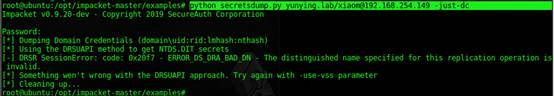

然后开启NTLMRelay脚本和Privexchange，设置ldap服务器的地址（也就是域控的地址）。

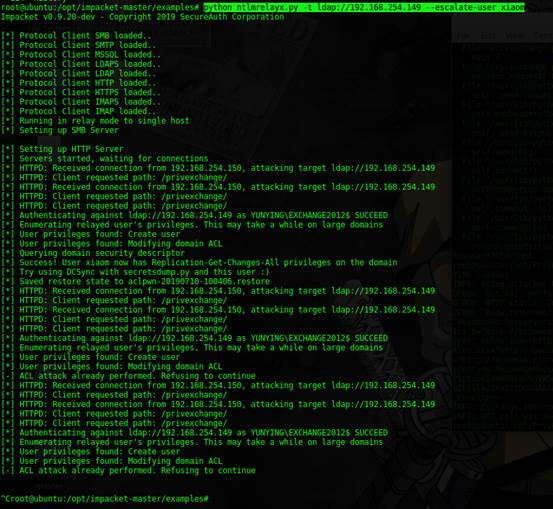

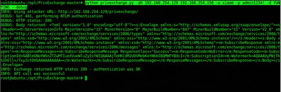

然后再次使用secretdump成功获取域内所有HASH（NTDS内容）

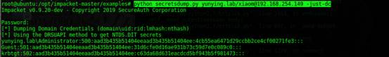

## Exchange与CVE-2019-1040

### 环境

这里的环境与上一个环境是一样的

```
域控：
windows server 2012
IP：192.168.254.149

Exchange服务器：
windows server 2012
Exchange 2013
IP：192.168.254.150

Ubuntu：
IP：192.168.254.129
```

### 复现SMB->LDAP

首先运行ntlmrelayx.py

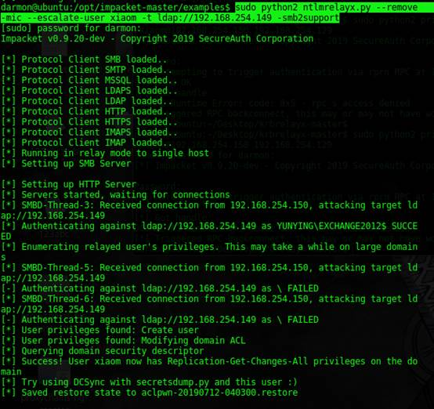

然后运行Printbug.py来触发SMB连接

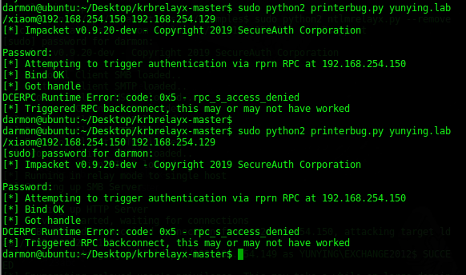

打完了之后成功DCSync获取域内所有用户密码的NTLM HASH值

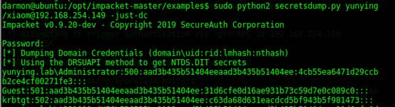

执行成功之后其实依然可以看到在LDAP的ACL中添加的xiaom@yunying.lab，权限为复制目录更改所有项。

## 失败的NTLMRelay

在这个实验之前在windows2008的环境下安装了Exchange2010，一直没有实验成功，这次换了环境成功之后分别抓包看了一下发现了两者的区别。首先看下报错，这里提示The client requested signing。This usually happens when relaying from smb to LDAP，也就是有签名。

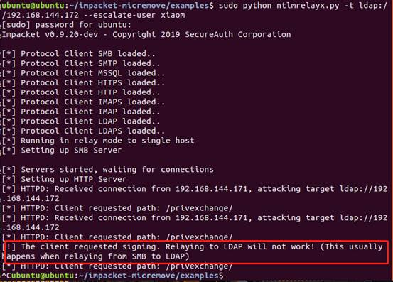

### PCAP对比

看了下在windows server 2012+Exchange2013环境下成功的PCAP包和失败的包对比在签名处是不同的。

这个是中继失败的：

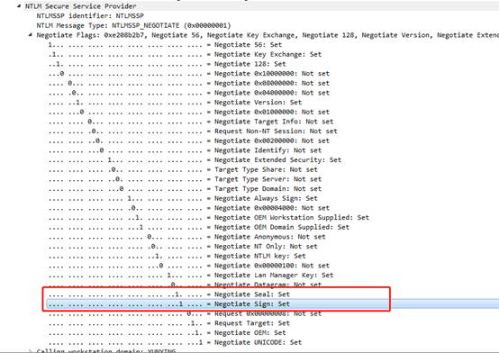

这个是中继成功的：

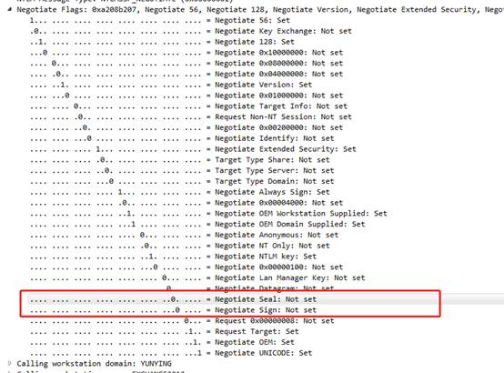

同时可以在NTLM的第三个流程NTLMSSP_AUTH中看到用于数字签名的session key的区别，成功中继的Session Key是空的，而中继失败的是存在Session Key的。

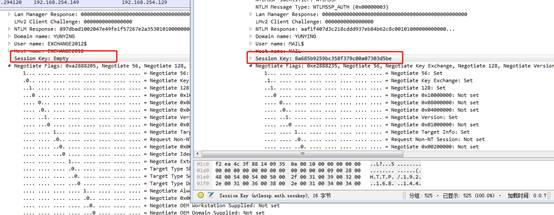

### SMB签名是如何被绕过的

微软为了防止SMB协议被中继使用了SMB签名的机制，但是只有一个SMB签名没办法防止中继攻击修改NTLM协议中的标志位，从而取消使用SMB签名。


为了防止签名的标志位被修改，微软引入了MIC（Message Integrity Code）的概念，他的值根据三次NTLM的内容进行计算，具体方法可以参考：

https://social.msdn.microsoft.com/Forums/en-US/cc304532-74ba-43e6-be3d-bb010d11e6ae/about-ntlm-mic-item-in-authenticatemessage?forum=os_windowsprotocols

如果存在任何一个NTLM包被修改，则验证不通过，同时MIC的值受协议中的msvAvFlag标志位限制，值为2时说明存在MIC。

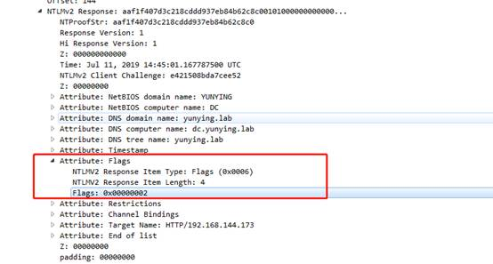

也就是说，SMB签名防止中间人攻击，MIC防止NTLM协议中的关于SMB的字段被修改，msvAvFlag防止MIC被删除，看似没有漏洞，但是实际情况是Microsoft服务器并没有对msvAvFlag的值做验证，并且允许无MIC的NTLM消息通过验证。这导致了攻击者可以直接删除MIC，并且通过修改FLAG中的标志位关闭SMB签名的验证。

其中修改的位置有：

```
1、将NTLM_NEGOTIAT中的NTLMSSP_NEGOTIATE_ALWAYS_SIGN，NTLMSSP_NEGOTIATE_SIGN标志位修改为0；
2、从NTLM_AUTHENTICATE消息中删除MIC；
3、从NTLM_AUTHENTICATE消息中删除版本字段（删除MIC字段而不删除版本字段将导致错误）；
4、取消设置NTLM_AUTHENTICATE消息中的以下标志：NTLMSSP_NEGOTIATE_ALWAYS_SIGN，NTLMSSP_NEGOTIATE_SIGN，NEGOTIATE_KEY_EXCHANGE，NEGOTIATE_VERSION。
```

从而完美绕过SMB签名。

### SMB签名为何能防止中继攻击

在NTLM中有个字段是Session Key，USER Session Key分为：

```
The LM User Session Key
The NTLM User Session Key
The LMv2 User Session Key
The NTLMv2 User Session Key
The NTLM2 Session Response User Session Key
```

Negotiate Sign标志的存在表明支持签名（保证消息完整性），Negotiate Seal标志表示支持密封（消息机密性），两者一起执行时表示密封消息并且生成签名（分别由SSPI MakeSignature和SSPI EncryptMessage方法完成）。

Session Key的生成：

其中在NTLMv2中的Session Key是由NTLMv2 HASH作为HMAC-MD5的盐加密challenge与blob的连接值，产生的16字节的输出值。客户端计算出这个值之后在flags中设置好标记位，然后把Session Key和NTLMv2 Response一起发送给服务端，服务端再校验Session Key的值。**所以Session Key不是签名，而是用来交换签名的加密密钥的****。**交换密钥之后得到了Master Key然后使用MasterKey生成关于**整个上层协议**（比如SMB或者LDAP）的签名。

​         在找到得出这些结论的资料之前一直思考的是NTLM既然是一个嵌套的协议如果签名判断的是NTLM协议的内容，那在中继的整个过程中实际上NTLM的那一段是不发生变化的，实际上是对整个上层协议进行签名，而不是只签名NTLM这一部分协议内容。

## 攻击前后的对比及分析

### 对比

使用两种方式攻击之后，都能够获取域内所有用户的HASH值（DCSync），那这个过程是怎么样的呢？实际上不论是第一种还是第二种最终攻击的对象都是LDAP服务，区别在于一个是从HTTP中继到LDAP，一个是从SMB中继到LDAP。而在LDAP被攻击之后，两个实验所执行的操作都是相同的。同时要说的一个点是在中继的过程中，无论是HTTP中继到LDAP还是SMB中继到LDAP，在对LDAP进行验证的时候使用的User name都是EXCHANGE2012$。

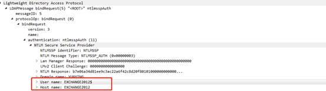

而EXCHANGE2012$作为主体属于Exchange Trusted Subsystem组，Exchange Trusted Subsystem组属于Exchange Windows Permissions组，而Exchange Windows Permissions组拥有WriteDACL的权限。

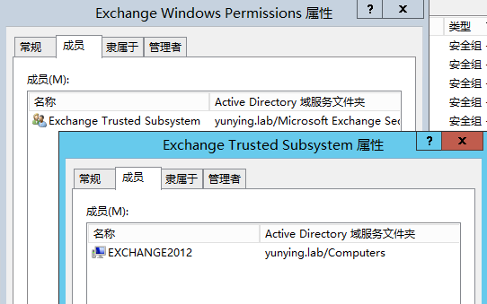

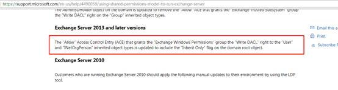

在攻击之前和攻击之后的区别在于LDAP的ACL发生了一些变化，打开ADSI编辑器，通过“属性”中的权限，可以看到ACL列表，其中添加了xiaom@yunying.lab，权限为复制目录更改所有项，其实也就是一个writeDACL的过程。

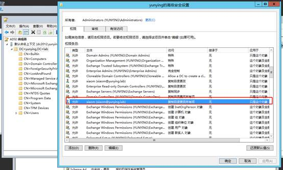

### ACL与DACL

说到WriteDACL那肯定要知道DACL是什么，还有就是为何修改了DACL之后就能够进行DCSync从而获取域内密码。

Windows的ACL分为两类：

```
1、Discretionary Access Control List (DACL)  自由访问控制列表
2、System Access Control List (SACL) 系统访问控制列表
```

每一种控制列表中都存在若干条ACE（Access Control Entries）

Access Token：

当线程与[安全对象](https://docs.microsoft.com/zh-cn/windows/win32/secauthz/securable-objects)交互或尝试执行需要特权的系统任务时，系统使用访问令牌来标识用户，访问令牌包括以下信息：

```
The security identifier (SID) for the user's account
SIDs for the groups of which the user is a member
A logon SID that identifies the current logon session
A list of the privileges held by either the user or the user's groups
An owner SID
The SID for the primary group
The default DACL that the system uses when the user creates a securable object without specifying a security descriptor
The source of the access token
Whether the token is a primary or impersonation token
An optional list of restricting SIDs
Current impersonation levels
Other statistics
```

DACL：

系统将每一个ACE中的受托人与线程访问令牌中标识的受托人进行比较。访问令牌包含标识用户和用户所属组账户的SID。令牌还包含标识当前会话的logon SID ，具体流程参见下图：


线程与安全对象之间的交互：

在Access check中，系统将线程访问令牌中的安全信息与安全对象安全描述符中的安全信息进行比较。

系统检查对象的DACL，查找应用于用户的ACE，并从线程的访问令牌中分组SID，系统会检查每个SID，知道授予或拒绝访问，或者知道没有其他ACE要检查为止。

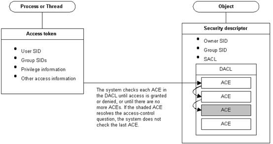

而这个漏洞正是通过高权限的账户，在DACL中添加了一条ACE，这里就是将普通账户xiaom赋予了“复制目录更改所有”权限，从而成功进行DCSync攻击。能够进行DCSync的三个权限：

```
1、复制目录更改Replicating Directory Changes (DS-Replication-Get-Changes)
2、复制目录更改所有Replicating Directory Changes All (DS-Replication-Get-Changes-All)
3、正在复制筛选集中的目录更改Replicating Directory Changes In Filtered Set (rare, only required in some environments)
```

### 利用链

通过上述内容可以看到一个完整的利用链为：

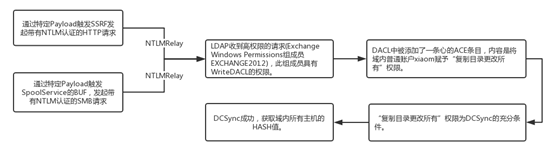

其中的关键点在于触发SSRF或者是SpoolService的bug，然后就是Exchange Windows Permissions组的高权限和添加的“复制目录更改所有”权限。