# Kerberos协议探索系列之扫描与爆破篇

# 0x00 前言

​         Kerberos是一种由MIT（麻省理工大学）提出的一种网络身份验证协议。它旨在通过使用密钥加密技术为客户端/服务器应用程序提供强身份验证。

在了解Kerberos的过程中，发现很多网站上的相关文章有一些是机器直接翻译过来的，也有一些写的比较优秀的文章，但是实操性比较弱，可能第一次了解Kerberos的同学会不知道怎么上手。所以本文主要是通过更详细的实验结合原理来说明与Kerberos相关的一些攻击手法。

本文将分为三篇。第一篇也就是这一篇的内容主要包括域环境和Kerberos协议的说明以及Kerberoasting的攻击方式。第二篇主要包括MS14068漏洞和Kerberos票据的利用说明。第三篇的内容主要说明关于Kerberos委派的攻击方式及原理。

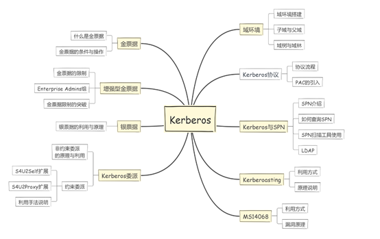

# 0x01域环境

由于Kerberos主要是用在域环境下的身份认证协议，所以在说之前先说下域环境的一些概念。首先域的产生是为了解决企业内部的资源管理问题，比如一个公司就可以在网络中建立一个域环境，更方便内部的资源管理。在一个域中有域控、域管理员、普通用户、主机等等各种资源。

在下图中YUNYING.LAB为其他两个域的根域，NEWS.YUNYING.LAB和DEV.YUNYING.LAB均为YUNYING.LAB的子域，这三个域组成了一个域树。子域的概念可以理解为一个集团在不同业务上分公司，他们有业务重合的点并且都属于YUNYING.LAB这个根域，但又独立运作。同样TEST.COM也是一个单独的域树，两个域树YUNYING.LAB和TEST.COM组合起来被称为一个域林。


本文就以根域为YUNYING.LAB的这个域来演示，YUNYING.LAB的域控是DC.YUNYING.LAB，子域NEWS.YUNYING.LAB和DEV.YUNYING.LAB的域控分别为NEWSDC.NEWS.YUNYING.LAB和DEVDC.DEV.YUNYING.LAB。

上面说的都是FQDN(Fully Qualified Domain Name)名称，也就是全限定域名，是同时包含主机名和域名的名称。 

例：DC.YUNYING.LAB中DC为主机名，域名为YUNYING.LAB，那他的FQDN名称就是DC.YUNYING.LAB。

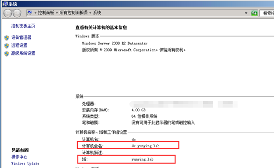

如何搭建域环境以及如何建立子域可参考网上的一些说明，这里放两个链接作为参考。

https://jingyan.baidu.com/article/19192ad8e1593ae53e5707be.html

http://blog.51cto.com/vbers/2058306

本域中采用的操作系统为Windows Server 2008 R2+Windows 7。

# 0x02Kerberos简介

在Kerberos认证中，最主要的问题是如何证明“你是你”的问题，如当一个Client去访问Server服务器上的某服务时，Server如何判断Client是否有权限来访问自己主机上的服务，同时保证在这个过程中的通讯内容即使被拦截或篡改也不影响通讯的安全性，这正是Kerberos解决的问题。在域渗透过程中Kerberos协议的攻防也是很重要的存在。

## 1 Kerberos协议框架

在Kerberos协议中主要是有三个角色的存在：

```
1、  访问服务的Client
2、  提供服务的Server
3、  KDC（Key Distribution Center）密钥分发中心
```

其中KDC服务默认会安装在一个域的域控中，而Client和Server为域内的用户或者是服务，如HTTP服务，SQL服务。在Kerberos中Client是否有权限访问Server端的服务由KDC发放的票据来决定。

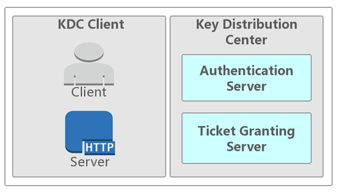

如果把Kerberos中的票据类比为一张火车票，那么Client端就是乘客，Server端就是火车，而KDC就是就是车站的认证系统。如果Client端的票据是合法的（由你本人身份证购买并由你本人持有）同时有访问Server端服务的权限（车票对应车次正确）那么你才能上车。当然和火车票不一样的是Kerberos中有存在两张票，而火车票从头到尾只有一张。

由上图中可以看到KDC又分为两个部分：

**Authentication Server**： AS的作用就是验证Client端的身份（确定你是身份证上的本人），验证通过就会给一张TGT（Ticket Granting Ticket）票给Client。

**Ticket Granting Server**： TGS的作用是通过AS发送给Client的票（TGT）换取访问Server端的票（上车的票ST）。ST（Service Ticket）也有资料称为TGS Ticket，为了和TGS区分，在这里就用ST来说明。

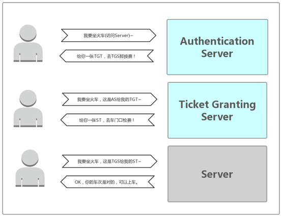

KDC服务框架中包含一个KRBTGT账户，它是在创建域时系统自动创建的一个账号，可以暂时理解为他就是一个无法登陆的账号。

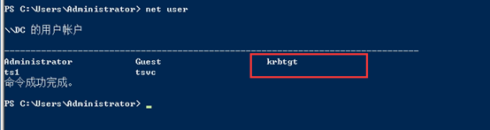

## 2 Kerberos认证流程

当Client想要访问Server上的某个服务时，需要先向AS证明自己的身份，然后通过AS发放的TGT向Server发起认证请求，这个过程分为三块：

**The Authentication Service Exchange**：Client与AS的交互

**The Ticket-Granting Service (TGS) Exchange**：Client与TGS的交互

**The Client/Server Authentication Exchange**：Client与Server的交互

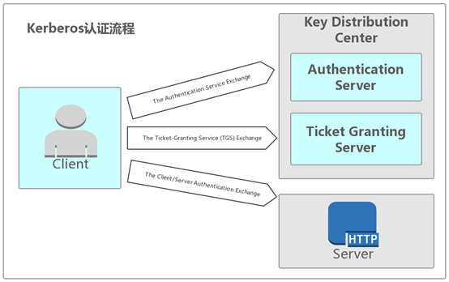

### (1)The Authentication Service Exchange

#### KRB_AS_REQ

Client->AS：发送 Authenticator1(Client密码加密TimeStamp)

​         第一步Client先向KDC的AS发送Authenticator1，内容为通过Client密码Hash加密的时间戳、Client ID、网络地址、加密类型等内容。

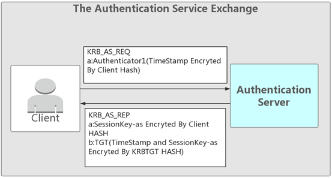

#### KRB_AS_REP

AS-> Client：发送Client密码加密的sessionkey-as 和票据TGT(KRBTGT HASH加密的sessionkey-as和TimeStamp)

​         在KDC中存储了域中所有用户的密码HASH，当AS接收到Client的请求之后会根据KDC中存储的密码来解密，解密成功并且验证信息。验证成功后返回给Client由Client密码HASH加密的sessionkey-as和TGT（由KRBTGT HASH加密的sessionkey-as和TimeStamp等信息）。

### (2)The Ticket-Granting Service (TGS) Exchange

#### KRB_TGS_REQ

Client ->TGS 发送 Authenticator2 (sessionkey-as加密TimeStamp) 和 票据TGT(KRBTGT HASH加密的sessionkey-as和TimeStamp)

​         Client接收到了加密后的Sessionkey-as和TGT之后，用自身密码解密得到Sessionkey-as，TGT是由KDC密码加密，Client无法解密。这时Client再用Sessionkey-as加密TimeStamp和TGT一起发送给KDC中的TGS（Ticket Granting Server）票据授权服务器换取能够访问Server的票据。

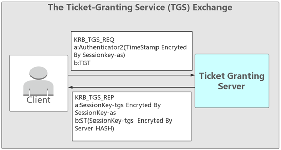

#### KRB_TGS_REP

TGS-> Client发送 密文1(sessionkey-as加密sessionkey-tgs) 和 票据ST(Server密码HASH加密sessionkey-tgs)

​         TGS收到Client发送过来的TGT和Sessionkey-as加密的TimeStamp之后，首先会检查自身是否存在Client所请求的服务。如果服务存在，则用KRBTGT密码解密TGT。一般情况下TGS会检查TGT中的时间戳查看TGT是否过期，且原始地址是否和TGT中保存的地址相同。验证成功之后将用sessionkey-as加密的sessionkey-tgs和Server密码HASH加密的Sessionkey-tgs发送给Client。

### (3)The Client/Server Authentication Exchange

#### KRB_AP_REQ

Client ->Server 发送 Authenticator3(sessionkey-tgs加密TimeStamp) 和 票据ST(Server密码HASH加密sessionkey-tgs)

Client收到sessionkey-as加密的sessionkey-tgs和Server密码HASH加密的sessionkey-tgs之后用sessionkey-as解密得到sessionkey-tgs，然后把sessionkey-tgs加密的TimeStamp和ST一起发送给Server。

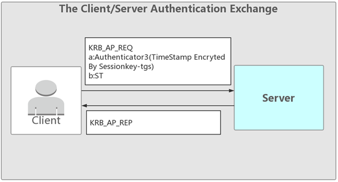

#### KRB_AP_REP

Server-> Client

server通过自己的密码解密ST，得到sessionkey-tgs,再用sessionkey-tgs解密Authenticator3得到TimeStamp，验证正确返回验证成功。

这就是Kerberos认证的流程，篇幅所限所以尽量简化说明，更详细的信息可以参考下面链接。

https://tools.ietf.org/html/rfc4120.html

## 3 PAC 

在Kerberos最初设计的几个流程里说明了如何证明 Client是Client而不是由其他人来冒充的，但并没有声明Client有没有访问Server服务的权限，因为在域中不同权限的用户能够访问的资源是有区别的。

所以微软为了解决这个问题在实现Kerberos时加入了PAC的概念，PAC的全称是Privilege Attribute Certificate(特权属性证书)。可以理解为火车有一等座，也有二等座，而PAC就是为了区别不同权限的一种方式。

### (1)PAC的实现

当用户与KDC之间完成了认证过程之后， Client需要访问Server所提供的某项服务时， Server为了判断用户是否具有合法的权限需要将Client的User SID等信息传递给KDC， KDC通过SID判断用户的用户组信息， 用户权限等， 进而将结果返回给Server， Server再将此信息与用户所索取的资源的ACL进行比较， 最后决定是否给用户提供相应的服务。

PAC会在KRB_AS_REP中AS放在TGT里加密发送给Client，然后由Client转发给TGS来验证Client所请求的服务。

在PAC中包含有两个数字签名PAC_SERVER_CHECKSUM和PAC_PRIVSVR_CHECKSUM，这两个数字签名分别由Server端密码HASH和KDC的密码HASH加密。

同时TGS解密之后验证签名是否正确，然后再重新构造新的PAC放在ST里返回给客户端，客户端将ST发送给服务端进行验证。

### (2)Server与KDC

PAC可以理解为一串校验信息，为了防止被伪造和串改，原则上是存放在TGT里，并且TGT由KDC hash加密。同时尾部会有两个数字签名，分别由KDC密码和server密码加密，防止数字签名内容被篡改。

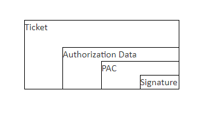

同时PAC指定了固定的User SID和Groups ID，还有其他一些时间等信息，Server 的程序收到ST之后解密得到PAC会将PAC的数字签名发送给KDC，KDC再进行校验然后将结果已RPC返回码的形式返回给Server。

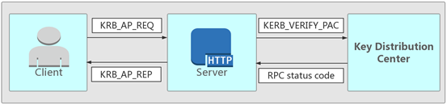

# 0x03 Kerberos与SPN

## 1 SPN简介

服务主体名称（SPN：Service Principal Names）是服务实例（可以理解为一个服务，比如HTTP、MSSQL）的唯一标识符。Kerberos身份验证使用SPN将服务实例与服务登录帐户相关联。如果在整个林或域中的计算机上安装多个服务实例，则每个实例都必须具有自己的SPN。如果客户端可能使用多个名称进行身份验证，则给定服务实例可以具有多个SPN。SPN始终包含运行服务实例的主机的名称，因此服务实例可以为其主机的每个名称或别名注册SPN。

如果用一句话来说明的话就是如果想使用Kerberos协议来认证服务，那么必须正确配置SPN。

## 2 SPN格式与配置：

在SPN的语法中存在四种元素，两个必须元素和两个额外元素，其中<service class>和<host>为必须元素：

```
<service class>/<host>:<port>/<service name>
<service class>：标识服务类的字符串
<host>：服务所在主机名称
<port>：服务端口
<service name>：服务名称
```

例：

如果我想把域中一台主机S2中的MSSQL服务注册到SPN中则可以使用命令Setspn -A MSSQLSvc/s2.yunying.lab:1433 tsvc

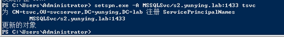

注册成功之后可以通过命令setspn -T yunying.lab –q */*或者setspn –q */*来查看已经注册的SPN。SPN在其注册的林中必须是唯一的。如果它不唯一，则身份验证将失败。

在注册SPN时，可以使用NetBIOS名称，如s2。也可以使用FQDN(Fully Qualified Domain Name全限定域名) ，如s2.yunying.lab。有可能存在某一种名称注册的SPN不能成功访问的情况，如果没有配置正确可以换一种名称试一试。

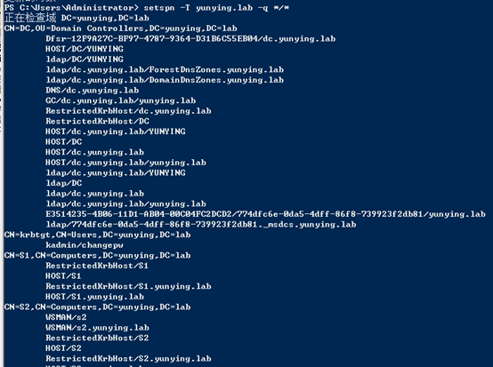

一般情况下基于主机的服务会省略后面两个组件，格式为<service class>/<host>：

```
MSSQLSvc/s2.yunying.lab
```

如果服务使用非默认端口或者此主机存在多个服务实例的情况下，需要包括端口号或服务名：

```
MSSQLSvc/ s2.yunying.lab:1433
```

## 3 SPN扫描

在了解了Kerberos和SPN之后我们可以通过SPN来获取我们想要的信息，比如想知道域内哪些主机安装了什么服务，我们就不需要再进行批量的网络端口扫描。在一个大型域中通常会有不止一个的服务注册SPN，所以可以通过“SPN扫描”的方式来查看域内的服务。相对于通常的网络端口扫描的优点是不用直接和服务主机建立连接，且隐蔽性更高。

### (1)扫描工具

扫描工具有多种，下面挑选几种较为常见的工具来说明一下：

Discover-PSMSSQLServers：

Discover-PSMSSQLServers是Powershell-AD-Recon工具集中的一个工具，用来查询已经注册了的MSSQL类型的SPN。

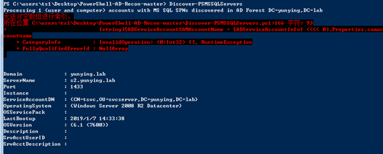

GetUserSPNs：

GetUserSPNs是Kerberoast工具集中的一个powershell脚本，用来查询域内注册的SPN。

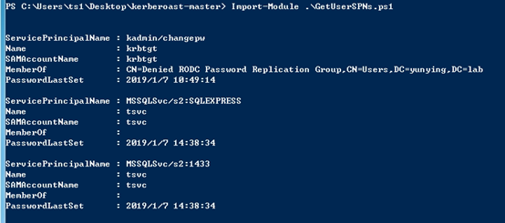

PowerView：

PowerView是由Will Schroeder（https://twitter.com/harmj0y）开发的Powershell脚本，在Powersploit和Empire工具里都有集成，PowerView相对于上面几种是根据不同用户的objectsid来返回，返回的信息更加详细。

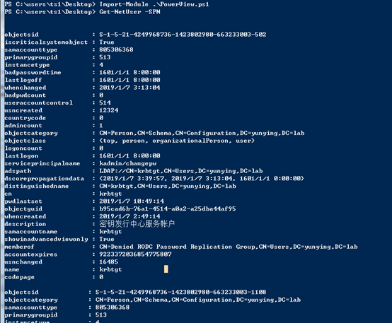

还有一些其他的脚本，使用方法基本类似，可以自己选择合适的工具使用，而且GitHub上面大多数都有下载链接。

### (2)原理说明

在SPN扫描时我们可以直接通过脚本，或者命令去获悉内网已经注册的SPN内容。那如果想了解这个过程是如何实现的，就需要提到LDAP协议。

LDAP协议全称是Lightweight Directory Access Protocol，一般翻译成轻量目录访问协议。是一种用来查询与更新 Active Directory 的目录服务通信协议。AD 域服务利用 LDAP 命名路径（LDAP naming path）来表示对象在 AD 内的位置，以便用它来访问 AD 内的对象。

LDAP 数据的组织方式：

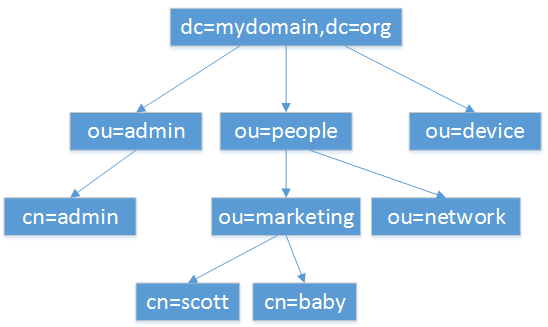

更直观的说可以把LDAP协议理解为一个关系型数据库，其中存储了域内主机的各种配置信息。

在域控中默认安装了ADSI编辑器，全称Active Directory Service Interfaces Editor (ADSI Edit)，是一种LDAP的编辑器，可以通过在域控中运行adsiedit.msc来打开（服务器上都有，但是只有域控中的有整个域内的配置信息）。

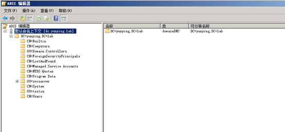

通过adsiedit.msc我们可以修改和编辑LADP，在SPN查询时实际上就是查询LADP中存储的内容。

比如在我们是实验环境域YUNYING.LAB中，存在名为svcserver的一个OU（Organization Unit，可以理解为一个部门，如开发部、财务部等等），其中包含了tsvc这个用户，从用户属性中可以看到tsvc注册过的SPN内容。


当我们在一台主机执行setspn -T yunying.lab -q */*命令查询域内SPN时，通过抓包可以看到正是通过LDAP协议向域控中安装的LDAP服务查询了SPN的内容。

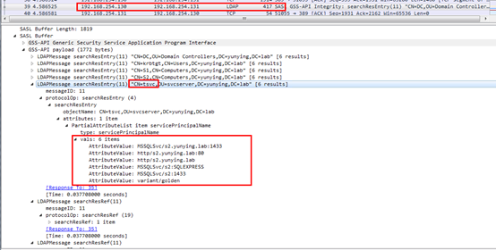

所以其实那些Powershell脚本其实主要就是通过查询LDAP的内容并对返回结果做一个过滤，然后展示出来。

# 0x04 Kerberoasting

在前面介绍Kerberos的认证流程时说到，在KRB_TGS _REP中，TGS会返回给Client一张票据ST，而ST是由Client请求的Server端密码进行加密的。当Kerberos协议设置票据为RC4方式加密时，我们就可以通过爆破在Client端获取的票据ST，从而获得Server端的密码。

下图为设置Kerberos的加密方式，在域中可以在域控的“组策略管理”中进行设置：


设置完成之后运行里输入“gpupdate”刷新组策略，策略生效。

## 1 早期的Kerberoasting

Kerberoasting这种攻击方式最初应该是由TimMedin（https://twitter.com/TimMedin）提出，下面我们通过实验来进行演示。

**实验环境：**

```
域：YUNYING.LAB
域控：Windows Server 2008 R2 x64(DC)
域内主机：Windows 7 x64(s1):用户ts1
域内主机：Windows Server 2008 R2 x64(s2):用户tsvc
```

**所需工具：**

```
Kerberoast工具包
Mimikatz
```

**攻击流程：**

一、在域内主机s1中通过Kerberoast中的GetUserSPNs.ps1或者GetUserSPNs.vbs进行SPN扫描。

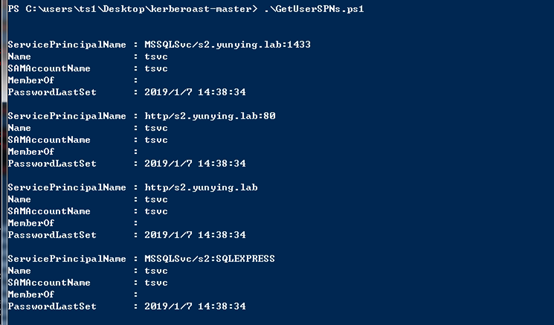

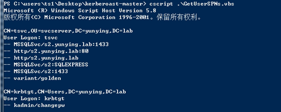

二、根据扫描出的结果使用微软提供的类KerberosRequestorSecurityToken发起kerberos请求，申请ST票据。

https://docs.microsoft.com/en-us/dotnet/api/system.identitymodel.tokens.kerberosrequestorsecuritytoken?redirectedfrom=MSDN&view=netframework-4.7.2

```powershell
Add-Type -AssemblyName System.IdentityModel
New-Object System.IdentityModel.Tokens.KerberosRequestorSecurityToken -ArgumentList "MSSQLSvc/s2:1433" 
```

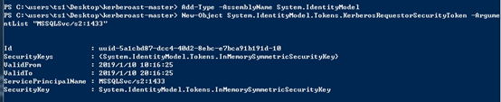

可以看到这个过程通过AS-REQ、AS-REP、TGS-REQ、TGS-REP这四个认证流程，获取到RC4方式加密的票据。

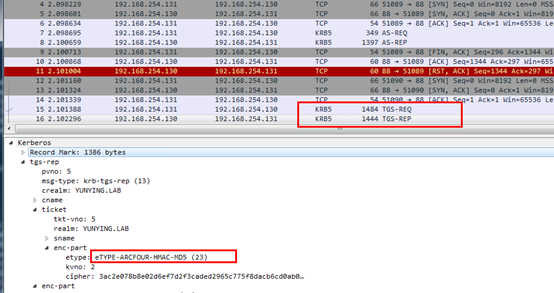

三、Kerberos协议中请求的票据会保存在内存中，可以通过klist命令查看当前会话存储的kerberos票据。

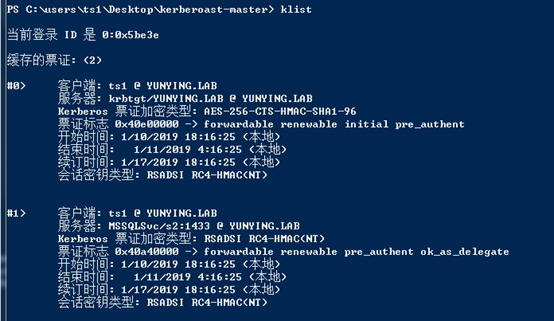

使用mimikatz导出。


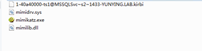

使用kerberoast工具集中的tgsrepcrack.py工具进行离线爆破，成功得到tsvc账号的密码admin1234!

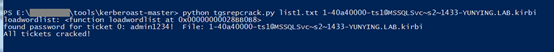

## 2 Kerberoasting的“新姿势”

**实验环境：**

```
域：YUNYING.LAB
域控：Windows Server 2008 R2 x64(DC)
域内主机：Windows 7 x64(s1):用户ts1
域内主机：Windows Server 2008 R2 x64(s2):用户tsvc
```

**所需工具：**

```
Invoke-Kerberoast.ps1
HashCat
```

**攻击流程：**

在之前的Kerberoasting中需要通过mimikatz从内存中导出票据，Invoke-Kerberoast通过提取票据传输时的原始字节，转换成John the Ripper或者HashCat能够直接爆破的字符串。环境不变，在s1主机上使用Invoke-Kerberoast脚本(这里使用的是Empire中的Invoke-Kerberoast.ps1)。

```powershell
Invoke-kerberoast –outputformat hashcat | fl
```

这里–outputformat参数可以指定输出的格式，可选John the Ripper和Hashcat两种格式，这里以Hashcat做演示。

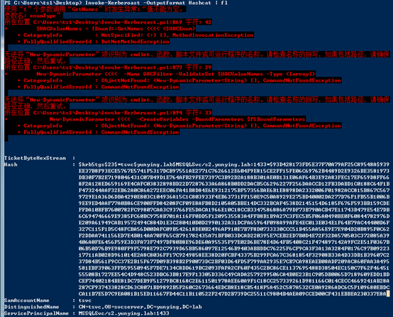

这个脚本申请访问的是MSSQLSvc/s2.yunying.lab:1433这个SPN。查看数据包可以看到Invoke-Kerberoast输出的Hash值就是TGS-REP中返回的票据内容，然后拼接成了Hashcat可以直接爆破的格式（以$krb5tgs$23*开头的）。

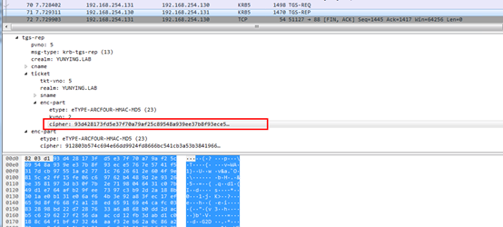

把内容保存至文档，也可以直接重定向到TXT文件：

```powershell
Invoke-Kerberoast -Outputformat Hashcat | fl > test1.txt
```

二、使用HASHCAT工具进行破解：

```
hashcat64.exe –m 13100 test1.txt password.list --force
```

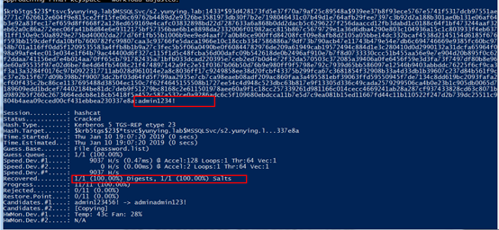

可以看到这里已经离线破解成功，输出了s2的密码admin1234!。在这里–m表示选择不同的加密类型，其中13100对应的是Kerberos 5 TGS-REP类型的密文。

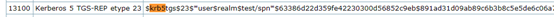

更多的Hashcat的类型可以参考：https://hashcat.net/wiki/doku.php?id=example_hashes

## 3 Invoke-kerberoast的实现

最初进行这个实验的时候是直接在GitHub上搜索的Invoke-kerberoast，当时下载的是https://github.com/malachitheninja/Invoke-Kerberoast这个地址的，但是下载完之后发现这个地址的工具并不能正常使用，查看代码发现在字符串拼接时格式的问题，输出的内容并不符合Hashcat的格式。然后直接使用了Empire中的Invoke-kerberoast.ps1脚本（下载地址：https://github.com/EmpireProject/Empire）。下面就拿这个脚本来说明。

在Invoke-kerberoast中通过两个关键函数看脚本执行的主要流程，一个是function Invoke-Kerberoast {}一个是function Get-DomainSPNTicket {}。

首先在Invoke-Kerberoast函数中通过脚本中的函数Get-DomainUser查询组内所有用户LDAP库中存储的内容，并去除krbtgt之后通过管道符传给Get-DomainSPNTicket。

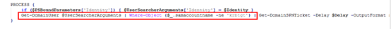

Get-DomainUser输出的值（-erroraction "Silentlycontinue"消除powershell中的红字告警，也可以直接去掉）：

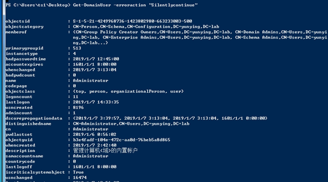

函数Get-DomainSPNTicket在接收到Get-DomainUser的输出结果后提取SPN（ServicePrincipalName）字段的值，然后取其中的第一个赋值给变量UserSPN。我们在代码中添加echo语句，然后再执行可以看到本次的结果选取了SPN列表中的第一条MSSQLSvc/s2:SQLEXPRESS。

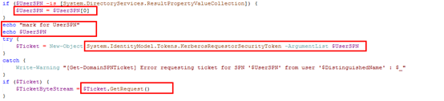

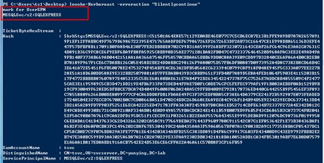

通过KerberosRequestorSecurityToken类的GetRequest()函数发起kerberos请求。随后通过匹配返回值，提取票据内容。

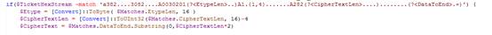

将提取的票据的值组合成Hashcat要求的格式之后赋值给变量HashFormat，也就是最终我们可以用Hashcat或者John the Ripper来爆破的值。

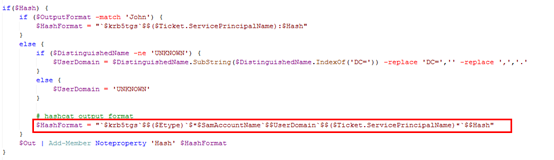

同样，上图框中的变量$Etype的值是23，实际上就是RC4加密算法的代号。

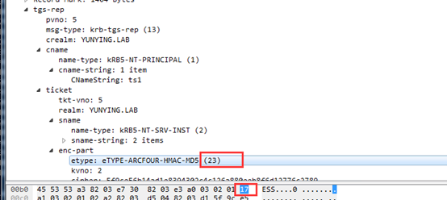

Kerberoasting的本质是通过破解在Kerberos认证流程中的KRB_TGS_REP这个过程中TGS返回给Client的票据内容来进行密码的获取，在一个大型的域中还是有一定的利用价值，并且这种方式是离线爆破，过程较为隐蔽。

# 0x05小结

本文主要说明了kerberos的基本原理以及SPN扫描的内容，介绍了Kerberoasting的攻击手法，Kerberos的原理较为复杂，但是深刻理解之后有助于对于了解其他Kerberos攻击手法是由很大帮助的。同时kerberos在windows的实现中与其他的协议也有一些相关联，多了解一点其他协议也是有必要的。下一篇中我将对MS14068漏洞和银票据金票据的利用和原理进行探究，感谢阅读。

# 实验工具

https://github.com/nidem/kerberoast

https://github.com/PyroTek3/PowerShell-AD-Recon

https://github.com/EmpireProject/Empire/blob/master/data/module_source/situational_awareness/network/powerview.ps1

# 参考链接

https://pentestlab.blog/2018/06/12/kerberoast/

http://www.harmj0y.net/blog/activedirectory/targeted-kerberoasting/

https://skypacer210.github.io/2014/04/09/kerberos-those-thing/

https://docs.microsoft.com/en-us/previous-versions/aa302203(v=msdn.10)#msdn_pac_request

https://tools.ietf.org/html/rfc1510