# Kerberos协议探索系列二票据篇

# 0x00 前言

在上一篇中说明了Kerberos的原理以及SPN的扫描和Kerberoasting的攻击方式，本章具体说一下Kerberos曾经爆出的一个经典的漏洞MS14068和金银票据的原理和利用方式。MS14068是一个比较经典的漏洞，曾经也有同学在平台上说明过，本文炒一次冷饭并且对增强型的金票据做一个说明。

# 0x01 MS14068

MS14068是一个能够使普通用户提权到域控权限的权限提升漏洞。攻击者可以通过构造特定的请求包来达到提升权限的目的。首先我们来说一下利用方式。

## 1 利用方式

实验环境：

```
域：YUNYING.LAB
域控：Windows Server 2008 R2 x64(DC)
域内主机：Windows 7 x64(s1):域帐户ts1
所需工具：
Pykek
mimikatz
```

攻击流程：

实验之前需要在域控主机查看是否安装了KB3011780补丁，可通过systeminfo来查看。

一、首先在域内主机s1上通过dir来访问域控的共享文件夹，示拒绝访问。

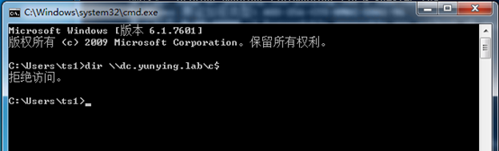

二、通过Pykek工具利用漏洞，我这里使用的是将python脚本编译之后的exe文件。

参数说明：

```
-u 域账号+@+域名称，这里是ts1+@+yunying.lab
-p 为当前用户的密码，即ts1的密码
-s为ts1的SID值，可以通过whoami /all来获取用户的SID值
-d为当前域的域控
```

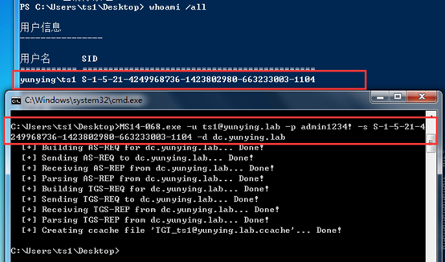

脚本执行成功会在当前目录下生成一个ccache文件。


三、使用mimikatz导入生成的ccache文件，导入之前cmd下使用命令klist purge或者在mimikatz中使用kerberos::purge删除当前缓存的kerberos票据。


再次dir访问域控共享已经可以成功访问。

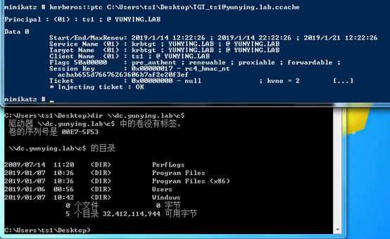

## 2 漏洞原理

MS14068工具在使用过程中抓包可以看到s1和域控192.168.254.130（实质上是与安装在域控上的KDC）有KRB_AS_REQ、KRB_AS_REP、KRB_TGS_REQ、KRB_TGS_REP四次交互。

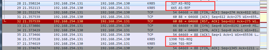

下面根据流程和工具源码来看漏洞是如何利用的：

### KRB_AS_REQ

首先程序通过build_as_req函数构建AS_REQ，在这里可以看到，参数pac_request设置为false。

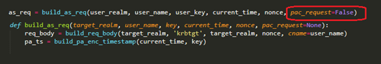

也就是说设置了这个参数之后会向KDC申请一张不包含PAC的TGT票据，这是微软默认的设计，在下列链接中有详细说明。

https://docs.microsoft.com/en-us/previous-versions/aa302203(v=msdn.10)#security-considerations

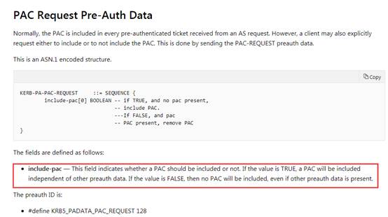

通过PCAP包可以更直观的看到在AS-REQ请求中的include-pac:False字段。这是造成这个漏洞的第一个因素。

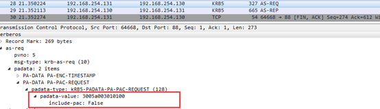

### KRB_AS_REP

在AS发起请求之后，KDC（AS）将返回一张不包含有PAC的TGT票据给Client。在这里是tgt_a。

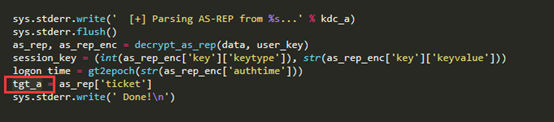

抓包可以看到这个以268fdb开头的TGT票据。

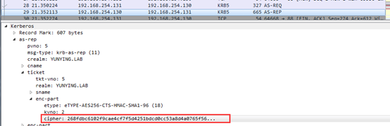

### KRB_TGS_REQ

攻击脚本使用了两个关键函数来实现这个过程，首先通过build构造PAC，然后通过build_tgs_req函数构造TGS-REQ的内容。

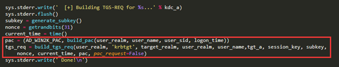

#### build_pac

当Client接收到AS返回的不带有PAC的TGT之后通过脚本中的build_pac函数开始构造PAC。

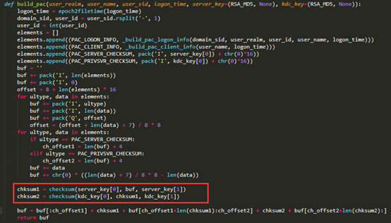

这里我们重点关注一下PAC中的chksum1和chksum2，也就是“PAC的引入”中提到的PAC的两个数字签名PAC_SERVER_CHECKSUM和PAC_PRIVSVR_CHECKSUM。

注意一下其中第一个参数server_key[0]和kdc_key[0]的值其实是程序指定的RSA_MD5，而Key的值为None，但原则上来说这个加密方式是应该由KDC来确定的。也就是说加密PAC_SERVER_CHECKSUM和PAC_PRIVSVR_CHECKSUM这两个数字签名的Key应该分别是Server密码HASH和KDC密码HASH，在这里却直接使Key为None，然后直接使用RSA_MD5方式加密。

这是漏洞形成的第二个因素，查看checksum函数即可验证这一点。

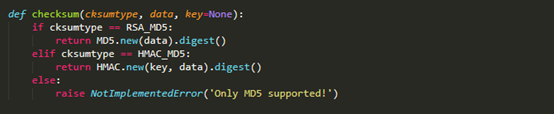

同时在这个过程中我们也需要关注一下user_sid这个参数，build_pac函数会将其分割，然后重新构造高权限的sid的值。在这里user_sid的值为S-1-5-21-4249968736-1423802980-663233003-1104，分割之后domain_sid为S-1-5-21-4249968736-1423802980-663233003，user_id为1104。

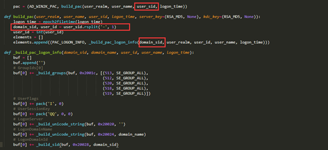

其中512、520、518、519分别为不同的组的sid号。513为DOMAIN USERS组。通过这种方式构造了包含高权限组SID的PAC。

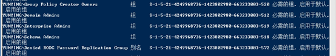

#### build_tgs_req

在build_tgs_req函数的参数中，authorization_data对应的为build_pac生成的pac。


这里将PAC传入build_tgs_req之后使用subkey将其加密。

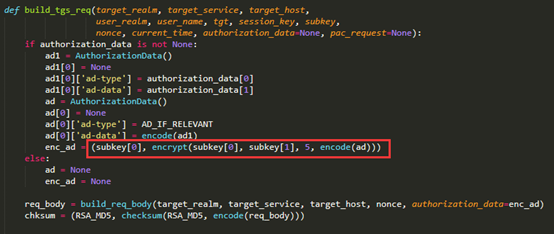

而通过下图可以看到subkey其实是函数generate_subkey生成的一串16位的随机数。

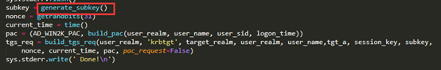

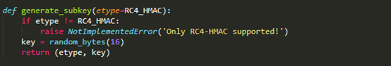

那现在为止出现的问题有：

```
A、在域中默认允许设置Include-pac的值为False（不能算漏洞，应该是微软对于某些特定场景的特殊考虑设计出的机制）。
B、PAC中的数字签名可以由Client端指定，并且Key的值可以为空。
C、PAC的加密方式也可以由Client指定，并且Key的值为generate_subkey函数生成的16位随机数。
D、构造的PAC中包含高权限组的SID内容。
```

也就是说通过这几点Client完全伪造了一个PAC发送给KDC，并且KDC通过Client端在请求中指定的加密算法来解密伪造的PAC以及校验数字签名，并验证通过。通过抓包可以看到在这个过程中将接收的TGT（268fdb开头）和加密方式为ARCFOUR-HMAC-MD5的PAC内容。

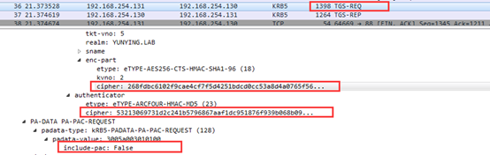

### KRB_TGS_REP

KDC在根据对伪造的PAC验证成功之后，返回给Client端一有新的TGT，并且这个TGT会将Pykek生成的PAC包含在其中，这里正常情况下返回的其实是一张用于发送给Server端做认证的ST票据。

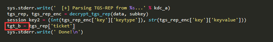

当Pykek工具接收到新的TGT之后就将其保存生成ccache文件。也就是说这时Client已经获得了一张包含有高权限PAC内容的正常的TGT票据（564eab开头）。

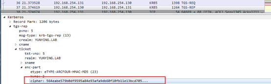

### 使用Mimikatz利用TGT访问DC共享文件夹

这时我们通过mimikatz来导入票证，并且用dir \\dc.yunying.lab\c$来访问域控的共享文件夹。

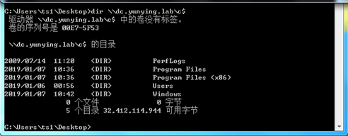

抓包可以看到这时Client端发起了两次TGS-REQ请求，重点关注一下第一次，此时用的票据就是使用mimikatz导入的TGT，也就是上面KRB_TGS_REP过程中返回的那个tgt_b（564eab开头）。

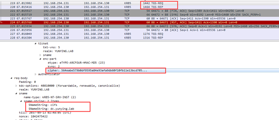

请求之后返回了一张针对dc.yunying.lab（域控）的CIFS票据也就是正常流程中的ST（Service Ticket）票据（234062开头）：

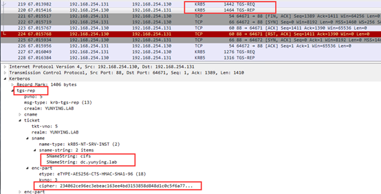

这时在抓的包中发现并没有AP_REQ这个流程，是因为在Kerberos中AP_REQ这个过程放在了服务的第一次请求中，这里是放在SMB的Session Setup Request中（其他协议同理，比如HTTP协议是放在GET请求中）。

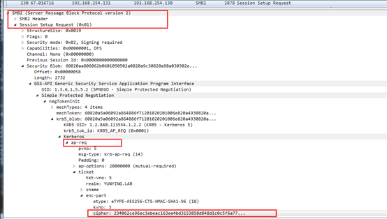

然后在SMB的Session Setup Response中做出响应，也就是AP-REP这个流程。

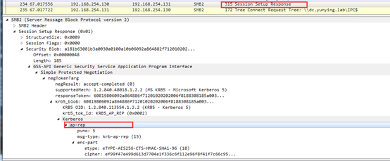

到此为止Client能够越权访问域控的共享文件夹。

## 3 防御与检测

此漏洞是一个14年的漏洞，多数产生在windows server 2008和windows server 2003的域环境中，所以安全补丁早已可以下载安装，用户可以通过在域控上安装KB3011780补丁来规避风险。

同时可以根据上文中提到的标记include-pac为False的特征来初步的筛选。

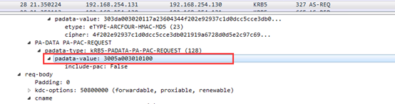

也可以通过windows日志来发现，如ID为4624登录到目标服务器、ID为5140表示网络共享对象被访问等等。

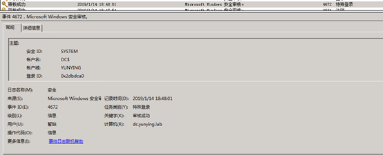

在这个漏洞中主要的问题是存在于KDC会根据客户端指定PAC中数字签名的加密算法，以及PAC的加密算法，来校验PAC的合法性。这使得攻击者可通过伪造PAC，修改PAC中的SID，导致KDC判断攻击者为高权限用户，从而导致权限提升漏洞的产生。

# 0x02 Golden Ticket

**简介**

Golden Ticket（下面称为金票）是通过伪造的TGT（Ticket Granting Ticket），因为只要有了高权限的TGT，那么就可以发送给TGS换取任意服务的ST。可以说有了金票就有了域内的最高权限。

**制作金票的条件：**

```
1、域名称 
2、域的SID值 
3、域的KRBTGT账户密码HASH
4、伪造用户名，可以是任意的
```

**实验环境**

```
域：YUNYING.LAB
域控：Windows Server 2008 R2 x64(DC)
域内主机：Windows 7 x64(s1):用户ts1
```

**所需工具**

​         Mimikatz

**实验流程**

金票的生成需要用到krbtgt的密码HASH值，可以通过mimikatz中的

lsadump::dcsync /domain:yunying.lab /user:krbtgt命令获取krbtgt的值。如果已经通过其他方式获取到了KRBTGT HASH也可以直接进行下一步。

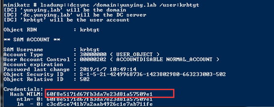

得到KRBTGT HASH之后使用mimikatz中的kerberos::golden功能生成金票golden.kiribi，即为伪造成功的TGT。

参数说明：

```
/admin：伪造的用户名
/domain：域名称
/sid：SID值，注意是去掉最后一个-后面的值
/krbtgt：krbtgt的HASH值
/ticket：生成的票据名称
```

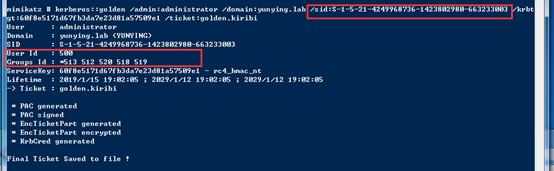

金票的使用

通过mimikatz中的kerberos::ptt功能（Pass The Ticket）将golden.kiribi导入内存中。

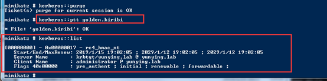

已经可以通过dir成功访问域控的共享文件夹。

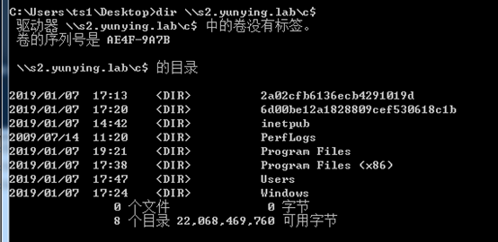

这样的方式导入的票据20分钟之内生效，如果过期再次导入就可以，并且可以伪造任意用户。

# 0x03 Silver Tickets

**简介**

Silver Tickets（下面称银票）就是伪造的ST（Service Ticket），因为在TGT已经在PAC里限定了给Client授权的服务（通过SID的值），所以银票只能访问指定服务。

**制作银票的条件：**

```
1.域名称 
2.域的SID值 
3.域的服务账户的密码HASH（不是krbtgt，是域控）
4.伪造的用户名，可以是任意用户名，这里是silver
```

**实验环境**

```
域：YUNYING.LAB
域控：Windows Server 2008 R2 x64(DC)
域内主机：Windows 7 x64(s1):用户ts1
```

**所需工具**

​         Mimikatz

**实验流程**

首先我们需要知道服务账户的密码HASH，这里同样拿域控来举例，通过mimikatz查看当前域账号administrator的HASH值。注意，这里使用的不是Administrator账号的HASH，而是DC$的HASH。

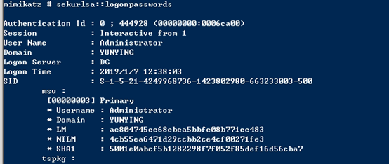

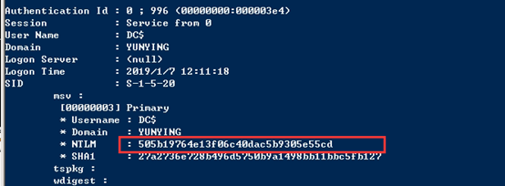

这时得到了DC的HASH值，通过mimikatz生成银票。

参数说明：

```
/domain：当前域名称
/sid：SID值，和金票一样取前面一部分
/target：目标主机，这里是dc.yunying.lab
/service：服务名称，这里需要访问共享文件，所以是cifs
/rc4：目标主机的HASH值
/user：伪造的用户名
/ptt：表示的是Pass The Ticket攻击，是把生成的票据导入内存，也可以使用/ticket导出之后再使用kerberos::ptt来导入
```

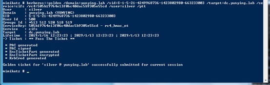

这时通过klist查看本机的kerberos票据可以看到生成的票据。

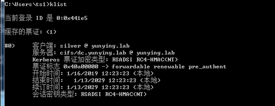

使用dir \\dc.yunying.lab\c$访问DC的共享文件夹。

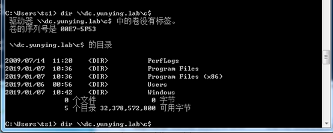

银票生成时没有KRBTGT的密码，所以不能伪造TGT票据，只能伪造由Server端密码加密的ST票据，只能访问指定的服务。

# 0x04 Enhanced Golden Tickets

在Golden Ticket部分说明可利用krbtgt的密码HASH值生成金票，从而能够获取域控权限同时能够访问域内其他主机的任何服务。但是普通的金票不能够跨域使用，也就是说金票的权限被限制在当前域内。

## 1普通金票的局限性

为什么普通金票会被限制只能在当前域内使用？

在上一篇文章中说到了域树和域林的概念，同时说到YUNYING.LAB为其他两个域（NEWS.YUNYING.LAB和DEV.YUNYING.LAB）的根域，根域和其他域的最大的区别就是根域对整个域林都有控制权。而域正是根据Enterprise Admins组（下文会说明）来实现这样的权限划分。

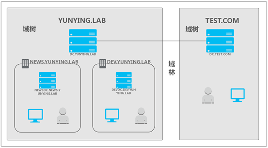

## 2 实验演示

**实验环境**

```
根域：YUNYING.LAB
域控：DC.YUNYING.LAB

子域：NEWS.YUNYING.LAB
域控：NEWSDC.NEWS.YUNYING.LAB

子域：DEV.YUNYING.LAB
域控：DEVDC.DEV.YUNYING.LAB

操作系统均为Windows Server 2008 R2 x64
```

**使用工具：**

​         Mimikatz

**实验流程：**

首先使用mimikatz在NEWSDC（NEWS.YUNYING.LAB的域控）上生成普通的金票，真实环境会是在域内的主机中，这里方便演示所以在域控中，原理和结果是一样的。

```
Kerberos::golden /admin:administrator /domain:news.yunying.lab /sid:SID /krbtgt:XXXXX /ptt
```

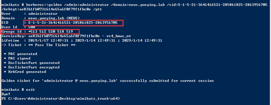

这里使用的是NEWS.YUNYING.LAB域的SID号，访问根域的DC共享文件夹被拒绝。

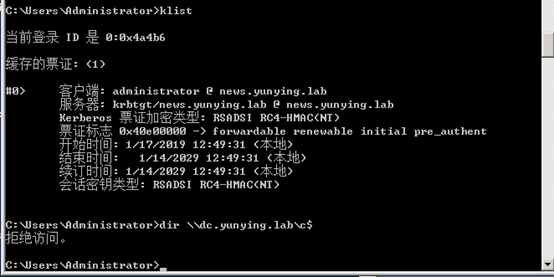

下面说明下具体原因。

### Enterprise Admins组

Enterprise Admins组是域中用户的一个组，只存在于一个林中的根域中，这个组的成员，这里也就是YUNYING.LAB中的Administrator用户（不是本地的Administrator，是域中的Administrator）对域有完全管理控制权。

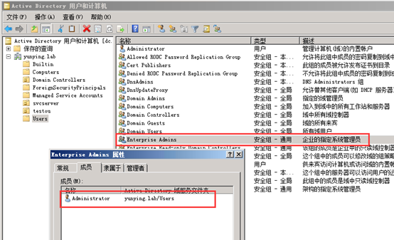

通过whoami命令在yunying.lab的域控上可以看到Enterprise Admins组的RID为519（最后三位）

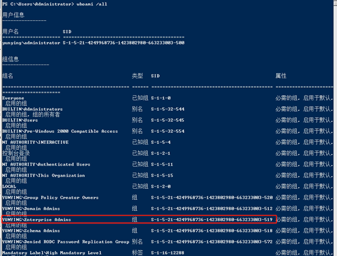

### Domain Admins组

可以看到在子域中是不存在Enterprise Admins组的，在一个子域中权限最高的组就是Domain Admins组。截图是news.yunying.lab这个子域中的Administrator用户，这个Administrator有当前域的最高权限。

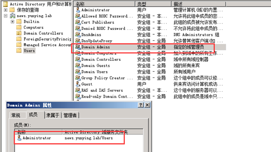

通过whoami命令也可以看到在news.yunying.lab这个子域中没有Enterprise Admins组的SID号。

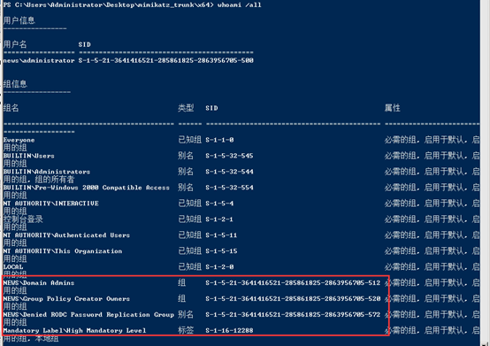

在子域中使用mimikatz创建的黄金票据不能跨域使用的原因也就在这里，通过whoami可以看到YUNYING.LAB中Enterprise Admins组的SID号是：

```
S-1-5-21-4249968736-1423802980-663233003-519
```

而NEWS.YUNYING.LAB域中的SID号是：

```
S-1-5-21-3641416521-285861825-2863956705-XXX
```

mimikatz通过/sid选项接收SID号然后在尾部拼接RID号（512,519等），拼接之后生成的Enterprise Admins组的完整SID是：

```
S-1-5-21-3641416521-285861825-2863956705-519
```

而这个SID在整个域林中都是不存在的，所以在子域中通过mimikatz生成的金票无法跨域或者是访问其他域的资源。在一个域林中，域控权限不是终点，根域的域控权限才是域渗透的终点。

## 3 突破限制

普通的黄金票据被限制在当前域内，在2015年Black Hat USA中国外的研究者提出了突破域限制的增强版的黄金票据。通过域内主机在迁移时LDAP库中的SIDHistory属性中保存的上一个域的SID值制作可以跨域的金票。这里没有迁移，直接拿根域的SID号做演示。

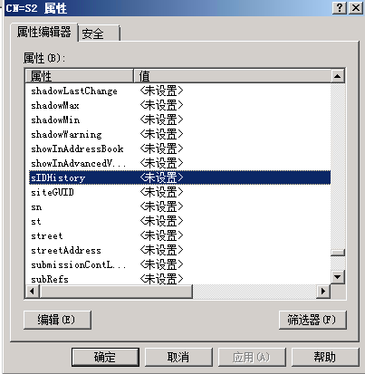

如果知道根域的SID那么就可以通过子域的KRBTGT的HASH值，使用mimikatz创建具有 Enterprise Admins组权限（域林中的最高权限）的票据。环境与上文普通金票的生成相同。

首先我们通过klist purge删除当前会话的Kerberos票据，也可以在mimikatz里通过kerberos::purge来删除。

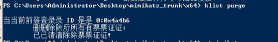

然后通过mimikatz重新生成包含根域SID的新的金票

```
Kerberos::golden /admin:administrator /domain:news.yunying.lab /sid:XXX /sids:XXX /krbtgt:XXX /startoffset:0 /endin:600 /renewmax:10080 /ptt
```

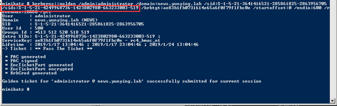

Startoffset和endin分别代表偏移量和长度，renewmax表示生成的票据的最长时间

注意这里是不知道根域YUNYING.LAB的krbtgt的密码HASH的，使用的是子域NEWS.YUNYING.LAB中的KRBTGT的密码HASH。

然后再通过dir访问DC. YUNYING.LAB的共享文件夹，发现已经可以成功访问。

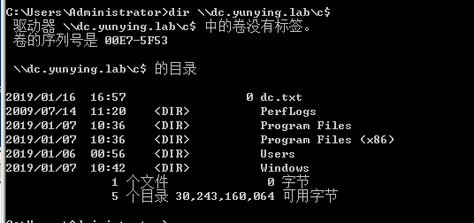

此时的这个票据票是拥有整个域林的控制权的。我们知道制作增强金票的条件是通过SIDHistory那防御方法就是在域内主机迁移时进行SIDHistory过滤，它会擦除SIDHistory属性中的内容。

# 0x05小结

​         本文主要说明了MS14068的利用方式和金银票据，主要用来提升和维持域内权限，通常情况下需要结合其他的域内攻击方式进行使用，比如获取了域控制器的NTLM HASH等内容时。下一文将介绍关于Kerberos委派相关的攻击手法和实现原理。

# 实验工具

https://github.com/gentilkiwi/mimikatz/releases/tag/2.1.1-20181209

https://github.com/abatchy17/WindowsExploits/tree/master/MS14-068

# 参考链接

https://adsecurity.org/?p=1640

https://adsecurity.org/?p=2011

https://www.cnblogs.com/backlion/p/8127868.html

https://blogs.msdn.microsoft.com/openspecification/2009/04/24/understanding-microsoft-kerberos-pac-validation/

 