# 迷一样的KB22871997

在内网渗渗透时，当我们通过GPP漏洞等方式获取到凭据后，将会使用这组凭据进行横向移动，进行权限提升。

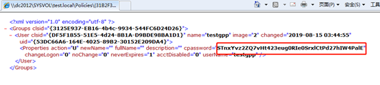

 不管通过那种方式获取到了明文密码或者HASH，横向移动是必不可少的一步，攻击者会使用常见的Psexec式(psexec psexec_psh)，Wmi式(wmicmd、wmiexec)、winrm式(evil-winrm)这几种方式来远程执行命令，除了这几款之外，目前还有一款综合式的远程执行命令的工具（crackmapexec），此款工具支持多种执行方式，并且支持批量。攻击者通过此类型的方式从内网中的一台主机横向移动以求获得更多的内网主机权限以达到提升内网权限或者是获取关键信息的目的。

在横向移动中有一种经久不衰的攻击的攻击是手法是Pass The Hash，Pass The Hash出现极大提升了攻击效率，利用windows的自认证机制而不需要破解HASH登录到系统中。

微软为了解决这个问题在2014年发布的更新KB2871997一度被传言能够防御Pass The Hash，下面我们就来看一下是否真的是这样。

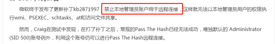

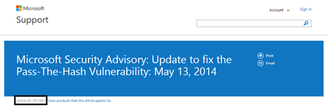

## KB2871997安装前后测试

首先看一下未安装补丁的情况，其中本地管理员组有三个帐户，主机名为TESTWIN7，所在域为TEST.LOCAL：

```
administrator是RID为500的本地管理员账号
testpth是RID非500的本地账号
TEST\xxm为加入了本地Administrators组的域帐户
```

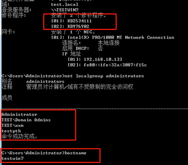

首先使用本地帐户administrator：

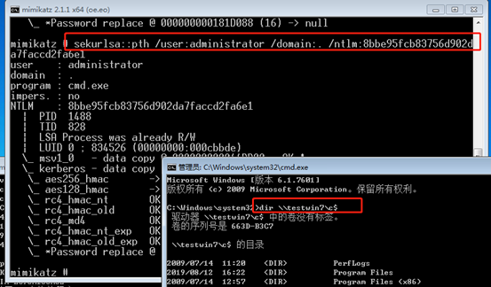

使用本地管理组帐户testpth:

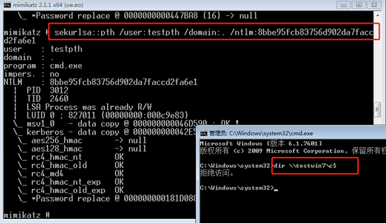

域用户xxm:


这里可以看到本地帐户administrator成功，本地管理员帐户testpth失败，域用户xxm成功，再来看一下安装补丁之后：

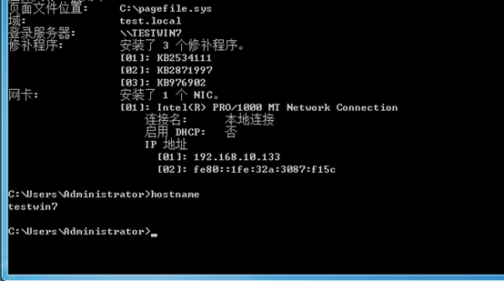

使用本地帐户administrator：

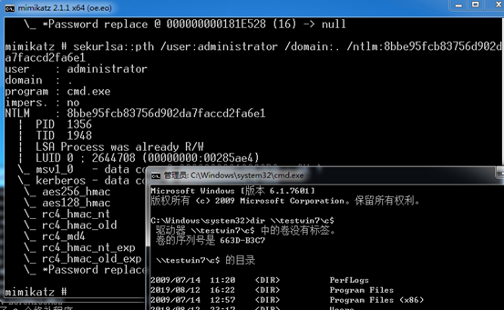

使用本地帐户testpth：

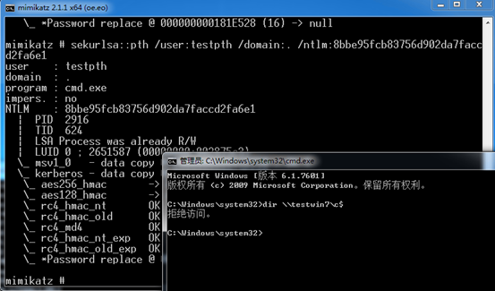

使用域帐户xxm：

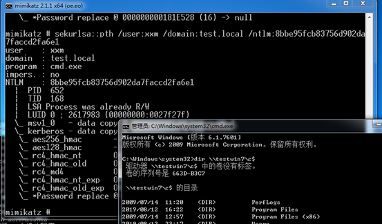

安装KB2871997前后的对比发现并没有区别。而之前非administrator的本地管理员Pass The Hash失败被认为是KB2871997的作用，实际是由于远程访问和UAC的限制。

## 远程访问和UAC

图中可以看到在windows中administrator的RID为500，并且是唯一的。同样为管理员组的本地帐户的testpth的RID的值为1000。

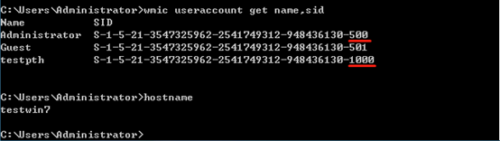

而域账号xxm使用的是域内的SID号。

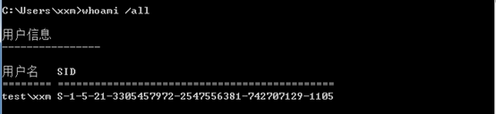

根据微软官方关于远程访问和用户帐户控制的相关文档可以了解到，UAC为了更好的保护Administrators组的帐户，会在网络上进行限制。https://support.microsoft.com/en-us/help/951016/description-of-user-account-control-and-remote-restrictions-in-windows

在使用本地用户进行远程登录时不会使用完全管理员权限（full administrator），但是在域用户被加入到本地管理员组之后，域用户可以使用完全管理员（full administrator）的Access Token运行，并且UAC不会生效。

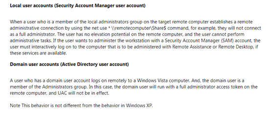

由此可见在上面的实验中域用户xxm能够成功PTH，而本地用户testpth无法成功，是因为以testpth的身份发起的请求被UAC拒绝。而administrator用户成功的原因同样是因为UAC。

### FilterAdministratorToken

在UAC组策略设置和注册表项设置的官方文档（https://docs.microsoft.com/en-us/previous-versions/windows/it-pro/windows-server-2008-R2-and-2008/dd835564(v=ws.10)#BKMK_BuiltInAdmin）中可以看到相关的描述，关于UAC的注册表中一个注册表键值为FilterAdministratorToken，且在Windows Server 2008默认为Disable。

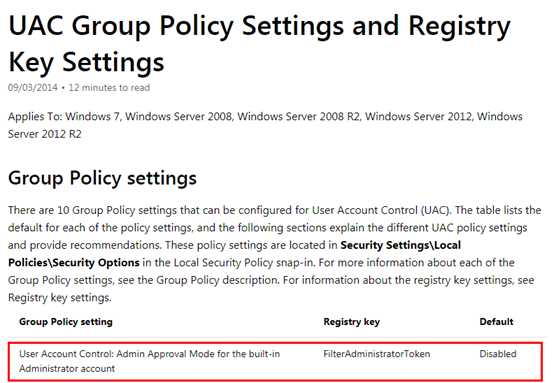

紧跟着文档中就添加了关于Admin Approval Mode的说明：

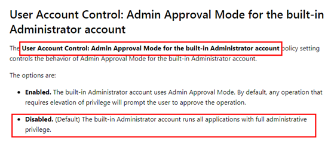

在UAC的控制策略中对于内置administrator帐户运行程序时会直接赋予完全管理权限（full administrative privilege）。这就是本地帐户administrator和域帐户xxm成功而本地管理员帐户testpth失败的原因。

Windows Server 2012相关的官方文档没有找到，但是在Windows Server 2012 R2版本服务器中可以看到本地安全策略中的“用户帐户控制：以管理员批准模式运行所有的管理员”已经默认开启。

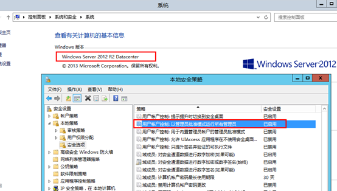

现在将testwin7主机的FilterAdministratorToken设置为1。

目录：

```
HKEY_LOCAL_MACHINE\SOFTWARE\Microsoft\Windows\CurrentVersion\Policies\System
```

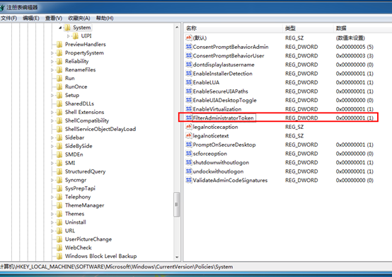

修改之后策略会立即生效，可以看到使用administrator的远程连接也被拒绝了

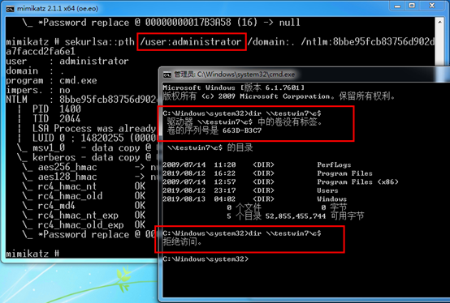

### LocalAccountTokenFilterPolicy

上面我们知道了使用非administrator的本地管理员帐户testpth进行Pass The Hash为什么失败，那如何禁用UAC的限制？

官方文档也是有提到的https://support.microsoft.com/en-us/help/951016/description-of-user-account-control-and-remote-restrictions-in-windows

可以通过修改注册表中LocalAccountTokenFilterPolicy选项的键值来进行更改。注册表项为

```
HKEY_LOCAL_MACHINE\SOFTWARE\Microsoft\Windows\CurrentVersion\Policies\System
```

如果LocalAccountTokenFilterPolicy注册表项不存在可以直接新建一条，并将值设置为1

LocalAccountTokenFilterPolicy的值默认为0（开启远程限制），为1时将关闭远程限制

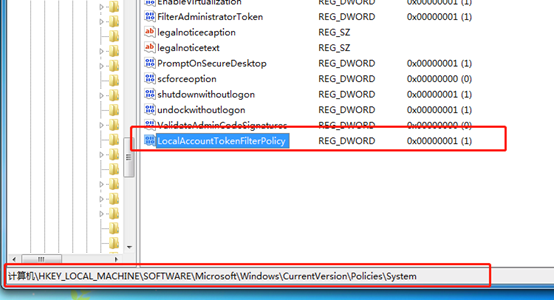

再次使用本地管理员账号testpth可以成功远程连接。

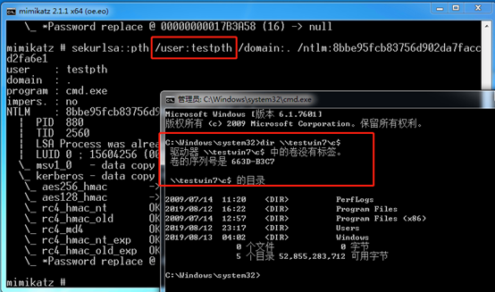

在防御远程访问的时候，这个注册表需要更加注意，默认情况下这个注册表键值为0，也就是说远程限制是开启的，如果由于误操作将此键值设置为1那无疑是对攻击者敞开了大门。

## KB2871997

事实证明KB2871997不能直接限制Pass The Hash，具体更改为以下几点。

```
1、支持“Protected Users”组；
2、Restricted Admin RDP模式的远程桌面客户端支持；
3、注销后删除LSASS中的凭据；
4、添加两个新的SID；
5、LSASS中只允许wdigest存储明文密码。
```

### 支持“Protected Users”组

“Protected Users”组是Windows Server 2012 R2域中的安全组，“Protected Users”组的成员会被强制使用Kerberos身份验证，并且对Kerberos强制执行AES加密。

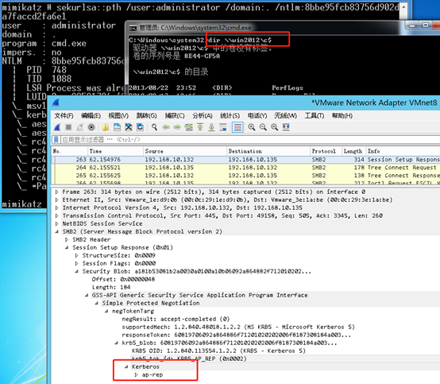

### Restricted Admin RDP模式的远程桌面客户端支持

Restricted Admin RDP模式是为了避免将Client端的凭据暴露给远程系统，同时也产生一种变种的Pass The Hash（Passing the Hash with Remote Desktop），这里不再说明。同时这个功能只支持windows server 2012和windows8.1。

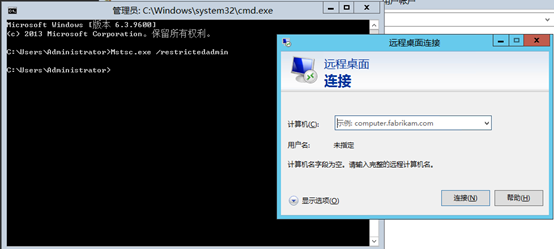

### 注销后删除凭证

在这个更新之前，只要用户登录系统，Windows就会在lsass中缓存用户的凭据，包括用户的明文密码、LM/NTLM HASH、Kerberos的TGT票据/Session Key。

### 新的SID

在更新中新添加了两个SID:

```
本地帐户LOCAL_ACCOUNT（S-1-5-113）所有本地帐户继承自此SID。
本地帐户和管理组成员LOCAL_ACCOUNT_AND_MEMBER_OF_ADMINISTRATORS_GROUP  （S-1-5-114）所有管理员组的本地用户继承此ID。
```

​         **注意**：S-1-5-114这里在中文操作系统中提供的翻译是“NT AUTHORITY\本地帐户和管理员组成员” 但是实际上是“所有本地Administrators组中的本地帐户”，即域用户即使被加入到了本地Administrators组也不继承此SID。

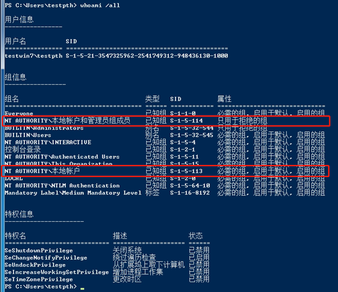

这个SID对于限制横向渗透的远程连接并没有任何实质的作用，它的主要作用是更方便的防止通过网络使用本地帐户登录。对于防御人员来说我们可以通过将这两个SID对应的组加入组策略中的下列选项从而限制攻击者能够从外部访问本地系统/服务：

```
拒绝从网络访问这台计算机
拒绝通过远程桌面服务登录
```


当我们直接将这两个组加入拒绝访问列表的方式来禁用使用本地帐户进行网络访问时，可以看到使用本地administrator帐户提示“登录失败：未授予用户再次计算机上的请求登录类型”。同时也实验了只加入“本地帐户（S-1-5-113）”这一个SID对应的组，发现administrator依然被拒绝！

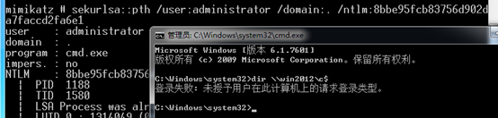

此时加入本地管理员组的域用户并不受影响，证明了上面的说法，也就是说其实这个补丁新添加的两个组在whoami /all里的中文翻译还是有一定的误导性的：

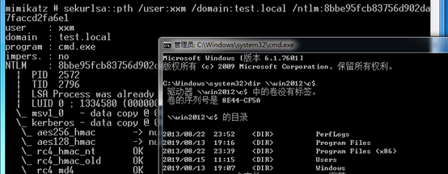

域管理员帐户administrator一样也可以成功

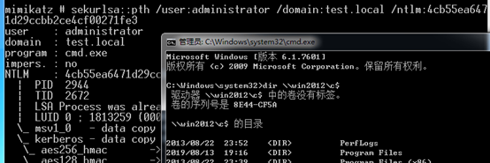

​         所以从实验结果来看这两个SID的作用就是将原本windows的本地组做了一个合并和处理，让用户在添加组策略时更方便一点，同时对于它们的关系来说S-1-5-114是S-1-5-113的子集，S-1-5-113包含所有本地用户，S-1-5-114包括的是Administrators组中的本地用户。

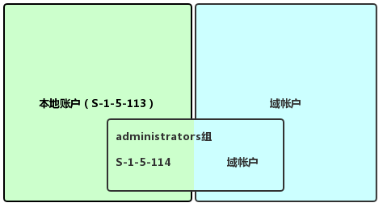

### LSASS中删除了明文凭证

前面说到LSASS会存储用户的明文密码，这个更新只允许WDigest在LSASS中存储明文密码。如果想防止WDigest的明文密码存储在LSASS中则可以通过修改下面注册表的键值来实现：

```
HKEY_LOCAL_MACHINE\System\CurrentControlSet\Control\SecurityProviders\WDigest
```

如果UseLogonCredential值设置为0，则WDigest不会将凭据存储在内存中。

如果UseLogonCredential值设置为1，WDigest将在内存中存储凭据。

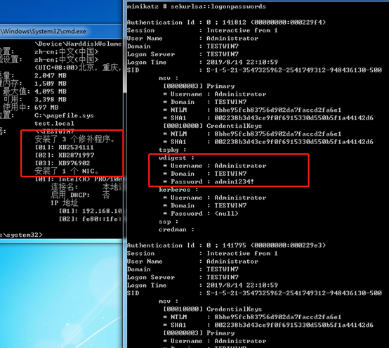

修改注册表之后发现已经不能看到WDigest保存的明文密码（需重启或注销登录生效）。

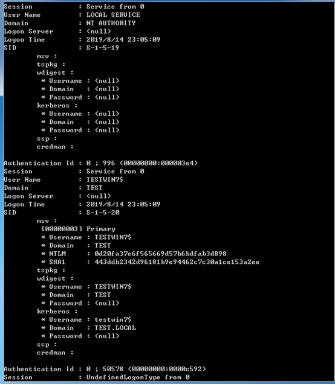

## 小结

看到这里防止Pass The Hash类型的横向移动的方法也很明显了：

```
1、将FilterAdministratorToken的值设置为1，限制本地administrator账户的远程登录；
2、可以使用脚本或者人工定时查看LocalAccountTokenFilterPolicy是否曾经被攻击者修改过；
3、在组策略中的“拒绝从网络访问这台计算机”将需要限制的组、用户加入到列表中。
```

而对于KB2871997的更新内容来说不管是“Protected Users”组和新的RDP模式以及新的SID号都没有起到实际的限制作用。

新的两个SID组S-1-5-113和S-1-5-114也只是把本地用户划分了一下，同时这样做是没有太大意义的，在S-1-5-113能够包括所有本地用户的情况下再划分出来一个S-1-5-114组，现实中应该很少存在只是限制S-1-5-114（即管理员组的本地用户）而不限制所有本地用户的情况。同时如果是为了提升安全等级最好的方式是把Administrators组的域用户一起禁用，而不是只禁用Administrators的本地成员。

唯一有点作用的就是在LSASS中删除了除WDigest之外的协议所保存的明文了但是他并不足以限制Pass The Hash这种类型的横向移动。